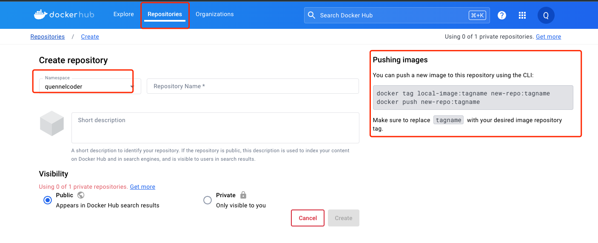

## how to push own docker image to dockerhub
部署自己的docker image 到docker hub， 可以方便 AWS 的 ESC 部署

- 官网注册账号：[Docker](https://hub.docker.com/)
- 本地 `docker login` 登陆
- 输入用户名和密码 [本人的](https://hub.docker.com/u/quennelcoder)
- 创建一个repository
- 