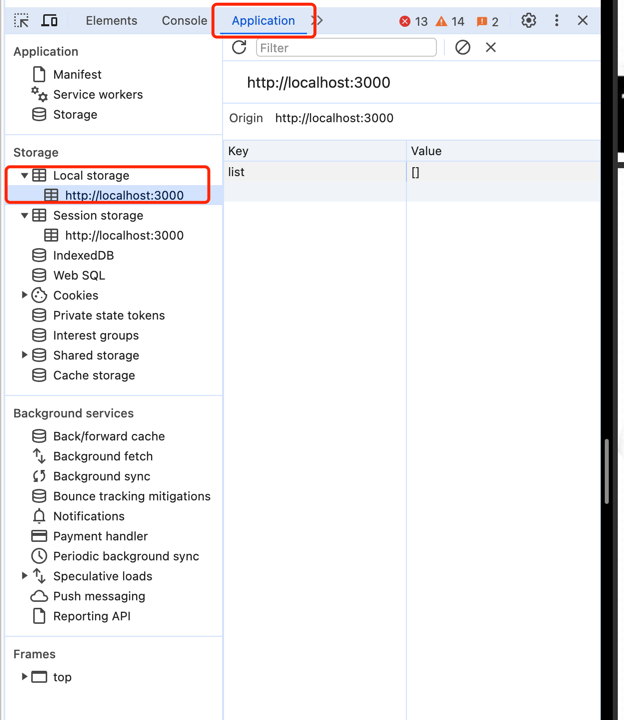

## 研究下react hook 跟 localStorage的关系
在做todo localStorage的时候，发现在 useState 和 useEffect 和localStorage之间的关系会很模糊  
经常发生莫名其妙的bug，并不知道它的原理，因此在这对这三者有个大概的调研  

### [localStorage](https://developer.mozilla.org/en-US/docs/Web/API/Window/localStorage)

窗口界面的 localStorage 只读属性允许您访问 Document 来源的 Storage 对象；  
存储的数据跨浏览器会话保存, 也就意味着可以关掉浏览器，再次访问也还是可以访问得到。

localStorage 与 sessionStorage 类似，不同之处在于 localStorage 数据没有过期时间，而 sessionStorage 数据会在页面会话结束（即页面关闭时）时被清除。  
当最后一个“私人”选项卡关闭时，“私人浏览”或“隐身”会话中加载的文档的本地存储数据将被清除。
[sessionStorage 、localStorage 和 cookie 之间的区别](https://juejin.cn/post/6844903713098694664)

### [useEffect](https://react.dev/reference/react/useEffect)
useEffect 是一个 React Hook，可让您将组件与外部系统同步。  
[基于 useEffect 封装高阶 hook API](https://juejin.cn/post/7078908086487875592)

### [useState](https://react.dev/reference/react/useState)
useState 是一个 React Hook，可让您向组件添加状态变量。
