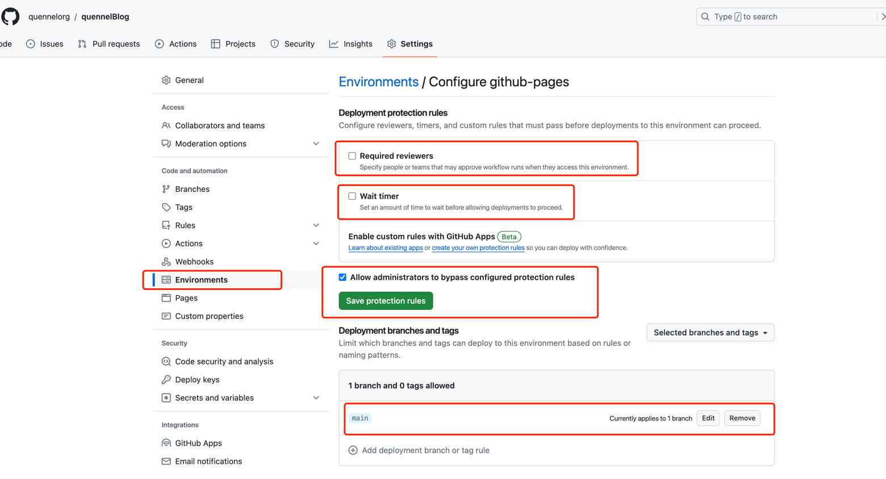
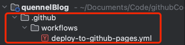
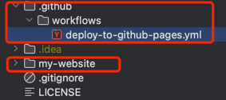
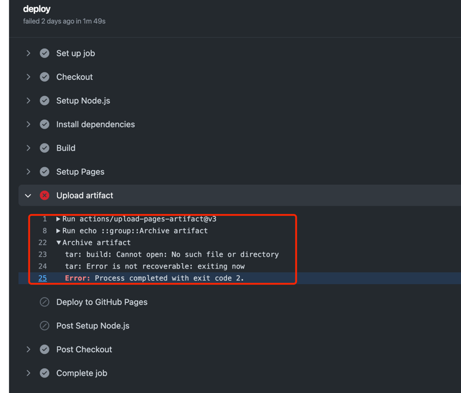
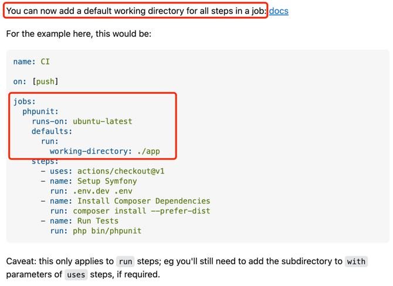

本文主要是为了记录如何在github部署静态网页，研究Github Action以及碰到的问题列举

## 什么是 Github Pages，Github Action？
从[Introduction to GitHub Packages](https://docs.github.com/en/packages/learn-github-packages/introduction-to-github-packages)
官方解释来看，Github Pages可以被当作一个静态网页托管服务器。通过这个服务器，我们可以免费，快速的部署自己的静态应用

关于Github Action的详细解释，我们可以参考这里[Publishing and installing a package with GitHub Actions](https://docs.github.com/en/packages/managing-github-packages-using-github-actions-workflows/publishing-and-installing-a-package-with-github-actions)

## 如何配置 Github Pages
[官方流程](https://pages.github.com/)
- **创建自己的repository**
- **在这个repository的setting里，修改pages设置**
- **在environment设置里可以自选修改**
## 如何配置 Github Action
[Understanding GitHub Actions](https://docs.github.com/en/actions/learn-github-actions/understanding-github-actions)
- **在repository目录下新增yml文件**
- **参考本blog如下配置[deploy-to-github-pages.yml](https://raw.githubusercontent.com/quennelorg/quennelBlog/main/.github/workflows/deploy-to-github-pages.yml)**
## 问题记录
### yarn exit code 127

这个问题，后续的解决方案有两个，应该是第二个起到了作用
- 在本地build，然后将yarn.lock同步上传
- 在部署yml文件中，将文件目录的层级写清楚，项目的结构是部署文件在根目录，然后项目文件夹也在根目录
- 也就是在yml中所有关于文件的引用路径都需要加上 `./my-website`，以下问题都有类似的问题
- 参考问题答案[Github actions: Dependencies lock file is not found in runners/path](https://stackoverflow.com/questions/68639588/github-actions-dependencies-lock-file-is-not-found-in-runners-path)
### actions/upload-pages-artifact fails

修改方法：
[修改默认项目文件目录](https://stackoverflow.com/questions/58139175/running-actions-in-another-directory)

参考答案：[actions/upload-pages-artifact fails at actions/upload-artifact with "No files were found with the provided path"](https://stackoverflow.com/questions/73310631/actions-upload-pages-artifact-fails-at-actions-upload-artifact-with-no-files-we)
## 后续计划
- 这次部署的是docusaurus静态网页，计划之后研究next.js，hexo，Jekyll, gatsby等
- 动态网页项目，react，vue，uniapp
