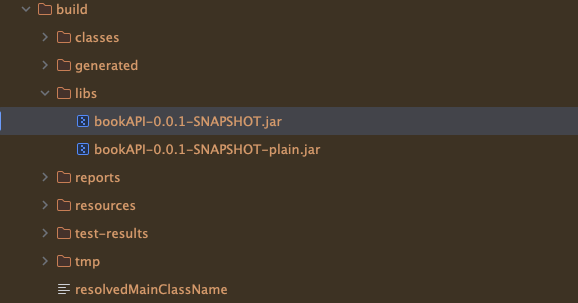
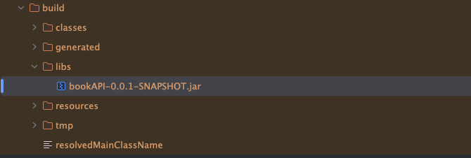

## 项目架构
### 构建工具
#### Gradle
[十分钟理解Gradle](https://www.cnblogs.com/Im-Victor/p/10787729.html)
常用命令：
- ./gradlew bootRun
- ./gradlew clean build

- ./gradlew clean bootJar
 
与build对比，bootJar更专注于构建一个可独立运行的SpringBoot应用程序，也就是Jar包
### 依赖库
#### Lombok 
[十分钟搞懂Lombok使用与原理](https://sites.google.com/site/javahuide9/brief/lombok-in-10-minutes)
[Java开发中用到的lombok是什么](https://docs.pingcode.com/ask/63690.html)
`@Data`：提供完整的getter、setter、equals、hashCode和toString方法。
`@NoArgsConstructor`、`@AllArgsConstructor`：分别生成无参构造、全参构造和必需参数构造函数。
#### Spring Web
[Spring Web Services](https://spring.io/projects/spring-ws)
[spring-web的作用](https://juejin.cn/s/spring-web%E7%9A%84%E4%BD%9C%E7%94%A8)
Spring Web是Spring框架的一个模块，它提供了用于创建Web应用程序的功能和组件，包括处理HTTP请求和响应、路由请求、处理表单数据、安全性等。

在Spring Web中，最核心的组件是Spring MVC（Model-View-Controller）框架，它可以将Web应用程序的业务逻辑、数据和UI分离，让开发人员更容易地维护和扩展应用程序。Spring MVC提供了很多有用的注解和组件，如@Controller、@RequestMapping、@ResponseBody等，可以帮助开发人员快速搭建RESTful风格的Web服务。

除了Spring MVC，Spring Web还提供了许多其他有用的功能和组件，如WebSocket支持、WebFlux框架、静态资源处理、模板引擎支持等。这些功能可以帮助开发人员更方便地构建Web应用程序，并且可以在不同的场景下灵活使用。

总的来说，Spring Web提供了许多强大的工具和框架，可以帮助开发人员更轻松地构建高性能、安全的Web应用程序。
TODO：webflux
#### Spring Data MongoDB
[MongoDB](https://www.mongodb.com/)
[Spring Data MongoDB 中文文档](https://springdoc.cn/spring-data-mongodb/)
[Spring Data MongoDB 核心概念](https://springdoc.cn/spring-data-mongodb/#repositories.core-concepts)
```java
public interface CrudRepository<T, ID> extends Repository<T, ID> {

  <S extends T> S save(S entity);      // 保存给定的实体

  Optional<T> findById(ID primaryKey); // 根据ID返回实体

  Iterable<T> findAll();               // 返回所有实体

  long count();                        // 返回实体数量

  void delete(T entity);               // 删除给定的实体

  boolean existsById(ID primaryKey);   // 根据ID判断实体是否存在

  // … more functionality omitted.
}
```
- Spring Data MongoDB 4.x二进制文件需要JDK 17级及以上，以及 Spring Framework 6.0.4 及以上。

TODO：
异常处理
分页查询
限制查询结果
Streamable 流式

## 实践
### 数据模型，针对数据库字段，建表
```java title="Model/book.java"
@Data
@AllArgsConstructor
@NoArgsConstructor
@Document(collection = "books")
public class Book {
    private String id;
    private String title;
    private String author;
    private String isbn;
    private String publishedDate;
}
```
### Repository层，针对数据库的CURD
```java title="repository/BookRepository.java"
public interface BookRepository extends MongoRepository<Book, String> {
}
```
### Service层，调用repository层，编写跟数据处理有关的逻辑，供Controller层调用
```java title="service/BookService.java"
@Service
public class BookService {
    @Autowired
    private BookRepository bookRepository;

    public Book save(Book book) {
        return bookRepository.save(book);
    }

    public List<Book> findAll() {
        return bookRepository.findAll();
    }

    public void deleteById(String id) {
        if (bookRepository.existsById(id)) {
            bookRepository.deleteById(id);
        }
    }
}
```
### Controller层，对外暴露出去的接口
```java title="controller/BookController.java"
@RestController
@RequestMapping("/book")
public class BookController {

    private final BookService bookService;

    public BookController(BookService bookService) {
        this.bookService = bookService;
    }

    @PostMapping
    public Book save(@RequestBody Book book) {
        return bookService.save(book);
    }

    @GetMapping
    public List<Book> findAll() {
        return bookService.findAll();
    }

    @DeleteMapping
    public void deleteById(@RequestParam String id) {
        bookService.deleteById(id);
    }
}
```
### 跨域问题
本地跑web端，访问本地springBoot可以访问
127.0.0.1:3000 -> 127.0.0.1:8080 可以访问
127.0.0.1:3000 -> 云端地址:8080 不能访问 跨域问题
`has been blocked by CORS policy: No 'Access-Control-Allow-Origin' header is present on the requested resource.`

[别在问我跨域问题了，跨域详解以及前端、后端、运维解决的方法统统写在这里了。](https://cloud.tencent.com/developer/article/1953193)

[axios实现跨域三种方法_跨域的解决方案](https://cloud.tencent.com/developer/article/2131856)

[SpringBoot之跨域过滤器配置允许跨域访问](https://blog.csdn.net/moshowgame/article/details/80364904?ops_request_misc=%257B%2522request%255Fid%2522%253A%2522159445287219195162510070%2522%252C%2522scm%2522%253A%252220140713.130102334.pc%255Fblog.%2522%257D&amp;request_id=159445287219195162510070&amp;biz_id=0&amp;utm_medium=distribute.pc_search_result.none-task-blog-2~blog~first_rank_v1~rank_blog_v1-1-80364904.pc_v1_rank_blog_v1&amp;utm_term=%E8%B7%A8%E5%9F%9F)

[Springboot解决跨域问题的三种方式](https://blog.csdn.net/weixin_50528222/article/details/130954461?spm=1001.2101.3001.6650.7&utm_medium=distribute.pc_relevant.none-task-blog-2%7Edefault%7EBlogCommendFromBaidu%7ERate-7-130954461-blog-80364904.235%5Ev43%5Epc_blog_bottom_relevance_base2&depth_1-utm_source=distribute.pc_relevant.none-task-blog-2%7Edefault%7EBlogCommendFromBaidu%7ERate-7-130954461-blog-80364904.235%5Ev43%5Epc_blog_bottom_relevance_base2&utm_relevant_index=14)
```java title="config/CorsConfig.java"
@Configuration
public class CorsConfig {
    @Bean
    public CorsFilter corsFilter() {
        CorsConfiguration config = new CorsConfiguration();
        // 允许所有域名进行跨域调用
        config.addAllowedOrigin("*");
        // 允许所有请求头
        config.addAllowedHeader("*");
        // 允许所有方法
        config.addAllowedMethod("*");
        // 添加映射路径，拦截一切请求
        UrlBasedCorsConfigurationSource source = new UrlBasedCorsConfigurationSource();
        source.registerCorsConfiguration("/**", config);
        return new CorsFilter(source);
    }
}
```
后续： nginx or bff
### 应用基本配置文件
mongoDB uri 按需填写，本地是localhost，远端的话是远端的ip地址
```properties title="application.properties"
server.port=8080
spring.application.name=bookAPI
spring.data.mongodb.uri= mongodb://localhost:27017/bookMongodb
spring.data.mongodb.database= bookMongodb
spring.data.mongodb.host= bookMongodb
spring.data.mongodb.port= 27017
```
## QA

### no main manifest attribute, in /app.jar
```shell
 java -jar build/libs/bookAPI-0.0.1-SNAPSHOT.jar    
```
应该使用 clean bootJar，build的文件有两个jar，这两个jar就会导致找不到哪一个，然后copy的时候就copy空的，copy空的话，执行的时候就是找不到主类
而且如果不加clean，之前的包不会被清理, 每次部署到云端的时候，需要本地跑一下


### @GetMapping 有两个，一个是有id，一个是没有参数id，不能在一个接口下，得换一种写法
[What is Ambiguous Mapping in Spring?](https://www.geeksforgeeks.org/what-is-ambiguous-mapping-in-spring/)