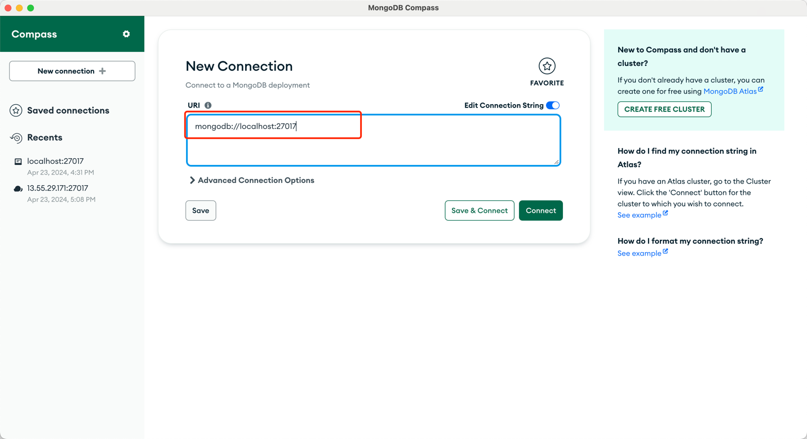
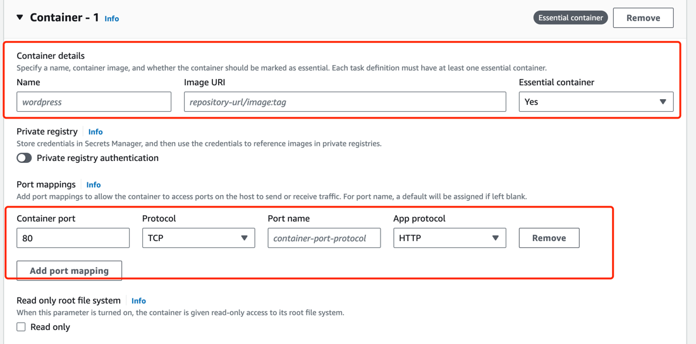
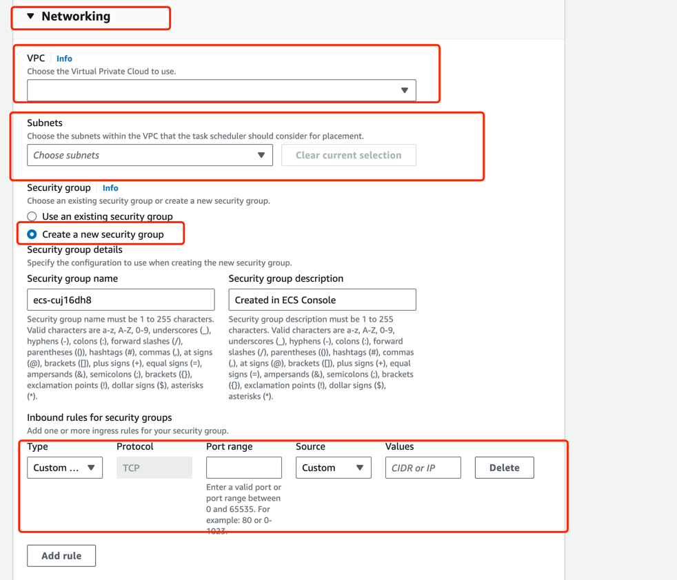

## [Docker](https://www.docker.com/)
[Docker docs](/docs/category/docker)

[Colima](https://github.com/abiosoft/colima)

Colima 是一款工具，可以轻松在 macOS 和 Linux 上运行 Docker 容器。
[Colima：Docker Desktop for Mac 的免费替代品，轻松管理容器和 K8s（支持 M1 芯片）](https://zhuanlan.zhihu.com/p/466229156)
常见的使用命令[Frequently Command](/docs/Docker/FrequentlyCommand)


拉取镜像，保存自己的镜像[Docker HUB](https://hub.docker.com/)


### MongoDB镜像
拉取镜像
`docker pull mongo:latest `

查看镜像
`docker images`

启动镜像`docker run -d -p 27017:27017 --name YourName mongo:latest`
- -d: 后台运行容器，并返回容器ID；
- -p: 指定端口映射，格式为：主机(宿主)端口:容器端口

可以在MongoDB compass查看 


也可以去docker镜像里面去看`docker exec -it mongo mongosh`

如果没问题，则给这个docker打tag，并push到dockerhub [PushToHub](/docs/Docker/PushToHub)

### JAVA 镜像
#### dockerfile
[Dockerfile for Java built with Gradle](/docs/Docker/DockerfileInJava)
在项目下：
```dockerfile title="Dockerfile"
FROM openjdk:17-jdk-alpine
VOLUME /tmp
ARG JAR_FILE=build/libs/*.jar
COPY ${JAR_FILE} app.jar
EXPOSE 8080
ENTRYPOINT ["java","-jar","/app.jar"]
```
FROM 指定基础镜像

VOLUME 挂载在哪个目录

ARG 启动参数

COPY 复制本地文件去docker容器

EXPOSE 暴露端口

ENTRYPOINT 启动时的默认命令

[Dockerfile命令详解](https://blog.csdn.net/tc979907461/article/details/107614667)

#### build and push
`docker build --platform linux/amd64 -t bookmanagement . `

--tag, -t: 镜像的名字及标签，通常 name:tag 或者 name 格式；可以在一次构建中为一个镜像设置多个标签。

` docker exec -it quennelcoder/mydocker:bookmanagementv1 /bin/bash `
`java -jar build/libs/bookAPI-0.0.1-SNAPSHOT.jar  `

如果没问题，则给这个docker打tag，并push到dockerhub [PushToHub](/docs/Docker/PushToHub)

#### QA
`exec /opt/openjdk-17/bin/java: exec format error`

主机arm，docker java17包 amd64，build之后是amd64，ecs得选择x86_64

[Docker: exec /usr/local/openjdk-11/bin/java: exec format error](https://stackoverflow.com/questions/75089403/docker-exec-usr-local-openjdk-11-bin-java-exec-format-error)

[exec /usr/local/openjdk-11/bin/java: exec format](https://waytohksharma.medium.com/exec-usr-local-openjdk-11-bin-java-exec-format-1b68effb2446)

[Docker on Mac M1 gives: "The requested image's platform (linux/amd64) does not match the detected host platform"](https://stackoverflow.com/questions/69054921/docker-on-mac-m1-gives-the-requested-images-platform-linux-amd64-does-not-m)

[“exec format error” or How Macs, M1s, Docker images, and AWS ECS/EKS conspired to waste a weekend.](https://medium.com/block-imperium-games/exec-format-error-or-how-macs-m1s-docker-images-and-aws-ecs-eks-conspired-to-waste-a-weekend-6fcd2ea063d1)

[When using COPY with more than one source file, the destination must be a directory and end with a /](https://stackoverflow.com/questions/53650492/when-using-copy-with-more-than-one-source-file-the-destination-must-be-a-direct)


## [AWS](https://aws.amazon.com/)
EC2 云上虚拟机
ECS Docker容器管理服务
VPC
虚拟私有云 (VPC) 是专用于您的 AWS 账户的虚拟网络。它在逻辑上与 AWS 云中的其他虚拟网络隔离。您可以为VPC指定IP地址范围、添加子网、添加网关、关联安全组等。子网是 VPC 中的一系列 IP 地址。
[ Virtual Private Cloud](https://aws.amazon.com/cn/vpc/)

[什么是 Amazon Elastic Container Service？](https://docs.aws.amazon.com/zh_cn/AmazonECS/latest/developerguide/Welcome.html)

[https://www.huaweicloud.com/zhishi/1584598122547.html](https://www.huaweicloud.com/zhishi/1584598122547.html)

[AWS ECS、EC2、EKS 和 Fargate 之间的关系](https://blog.csdn.net/winfield821/article/details/135387756)

[白皮书：Amazon EC2 Container Service（ECS）上的微服务架构（下篇）](https://aws.amazon.com/cn/blogs/china/microservices-on-amazon-ecs-2/)

[AWS EC2 Container Service 概念與使用介紹](https://medium.com/@chihsuan/aws-ec2-container-service-%E6%A6%82%E5%BF%B5%E8%88%87%E4%BD%BF%E7%94%A8%E4%BB%8B%E7%B4%B9-28258247947a#:~:text=Task%EF%BC%9A%E4%B8%80%E8%88%AC%E6%88%91%E5%80%91%E9%80%9A%E5%B8%B8%E5%8F%AA,%E6%8F%90%E4%BE%9B%E8%87%AA%E5%8B%95%E9%87%8D%E5%95%9F%E7%9A%84%E5%8A%9F%E8%83%BD%E3%80%82)


### 创建Clusters
[Amazon ECS Clusters](https://docs.aws.amazon.com/zh_cn/AmazonECS/latest/developerguide/clusters.html)
### 创建Task definitions
#### 选对平台 amd64 是x86 Inter or amd；arm64是m1
#### 容器配置，port mapping
- 容器地址 填写 dockerhub里的地址 `docker pull your-docker-name:tag` 这里 `your-docker-name:tag` 就是地址
- port mapping 将需要的端口对应暴露出去，比如 `8080，27017`

### 跑Task 创建 Service
在跑Task之前，要去创建VPC

一定要忘记添加Security group rule，将不同的端口暴露出去 `8080，27017`

[How many subnets can we add to aws VPC with different CIDR blocks](https://stackoverflow.com/questions/49199804/how-many-subnets-can-we-add-to-aws-vpc-with-different-cidr-blocks)

成功之后就可以跑起来了


### EC2
[how-deploy-spring-boot-application-aws-ec2](https://www.linkedin.com/pulse/how-deploy-spring-boot-application-aws-ec2-3-rakesh-reddy-kjiwc/)

[Deploying a Spring Boot Application on AWS with Docker](https://medium.com/@rosuth/deploying-a-spring-boot-application-on-aws-with-docker-e065ab3ab501)

### QA

#### WARNING: The requested image's platform linux/amd64 does not match the detected host platform linux/arm64/v8 and no specific platform was requested

docker 拉的镜像是 linux amd64， m1芯片是arm64

[WARNING: The requested image's platform (linux/amd64) does not match the detected host platform (linux/arm64/v8)](https://dev.to/docker/run-x86-containers-on-apple-mac-m1-with-rosetta-2-417a)

#### MongoDB: No server chosen by ReadPreferenceServerSelector
mongodb 也在docker
将springboot到放到docker里，然后`ServerDescription{address=localhost:27017, type=UNKNOWN, state=CONNECTING}]`，连接出错，如果将localhost改成远程的地址则没有问题

[SpringBoot in Docker not connecting to Mongo in Docker](https://stackoverflow.com/questions/56938511/springboot-in-docker-not-connecting-to-mongo-in-docker)

[Springboot整合MongoDB的Docker开发，其它应用也类似](https://www.cnblogs.com/larrydpk/p/13247127.html)


## 优秀资源
### Spring Boot MongoDB Docker Gradle
[Spring Boot MongoDB Docker Example](https://frugalisminds.com/spring-boot-mongodb-docker-example/)

[Deploy Spring Boot application and MongoDB as Containers Using Docker](https://chanakambkarunarathna.medium.com/deploy-spring-boot-application-and-mongodb-as-containers-using-docker-5e38c687525b)

[Get started with Spring Boot, MongoDB and Docker Compose](https://sfmohassel.medium.com/get-started-with-spring-boot-mongodb-and-docker-compose-cfae8283ed1b)

[Spring Boot – Creating docker image using Gradle](https://www.geeksforgeeks.org/spring-boot-creating-docker-image-using-gradle/)

[MongoDB Passwordless Authentication : Spring Boot App in ECS](https://contact-rajeshvinayagam.medium.com/mongodb-passwordless-authentication-spring-boot-app-in-ecs-8c55079d63bd)


### springboot mongo es2 or ecs youtube
[Spring Boot Microservice with Mongo Database on AWS EC2](https://www.youtube.com/watch?v=79Vn8A907ZA&ab_channel=TechnoTownTechie)

[AWS ECS Setup | Run Springboot Microservice & MongoDB in Elastic Container Service ECS](https://www.youtube.com/watch?v=reKPCV5y0l4)

[Master ECS | Docker on AWS | Live Project Based | Deploy Microservice on ECS | AWS](https://www.youtube.com/watch?v=gsfKVa2-GtI&ab_channel=PeaceOfCode)
