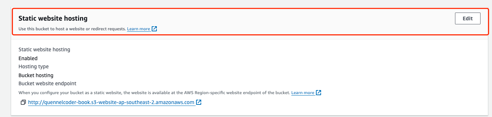

## 前端项目结构
### view
UI展示
### viewModel
数据操作
### model
数据模型

## ios应用
[SwiftUI](https://developer.apple.com/cn/xcode/swiftui/)

[SF Symbols 5](https://developer.apple.com/sf-symbols/)
Apple has a dedicated App for this called SF Symbols. You can preview all symbols right from the Xcode app using the Library in XCode14.

command + shift + L

[IOS APP Transport security has blocked a cleartext HTTP](https://stackoverflow.com/questions/31254725/transport-security-has-blocked-a-cleartext-http)

[IOS 最简单的DatePicker](https://blog.liboliu.com/a/142)

[SwiftUI 使用URLSession异步调用JSON格式接口](https://blog.liboliu.com/a/142)


## web应用
[React](https://zh-hans.react.dev/)

[MUI UI框架](https://mui.com/)

[Docusaurus](https://docusaurus.io/)
` yarn create docusaurus --typescript`

go to the project folder `yarn start`

[GithubAction 部署](/blog/githubAction)

[什么是 Amazon S3？](https://docs.aws.amazon.com/zh_cn/AmazonS3/latest/userguide/Welcome.html)

[一文读懂 AWS S3](https://zhuanlan.zhihu.com/p/112057573)
- create s3
- upload file
- system setting [WebsiteAccessPermissionsReqd](https://docs.aws.amazon.com/AmazonS3/latest/userguide/WebsiteAccessPermissionsReqd.html)
  - Step 1: Edit S3 Block Public Access settings
  - Step 2: Add a bucket policy
```json
{
    "Version": "2012-10-17",
    "Statement": [
        {
            "Sid": "PublicReadGetObject",
            "Effect": "Allow",
            "Principal": "*",
            "Action": [
                "s3:GetObject"
            ],
            "Resource": [
                "arn:aws:s3:::Bucket-Name/*"
            ]
        }
    ]
}
```
  - enable true for (setting Static website hosting)


  
https://quennelorg.github.io/bookManagementFrontend/

http://quennelcoder.s3-website-ap-southeast-2.amazonaws.com/


## Good Resource
### IOS
[Swift Playgrounds Book](https://www.youtube.com/watch?v=R4j5SU1WSLI)
[SwiftUI-Foundation-Series GitHub](https://github.com/codecat15/SwiftUI-Foundation-Series/tree/main)
[SwiftUI Foundation-Series](https://www.youtube.com/playlist?list=PLb5R4QC2DtFs8alYSS_cqNjLTDHucbuFl)
[How to make an API Request in SwiftUI with MVVM pattern](https://medium.com/dhiwise/how-to-make-an-api-request-in-swiftui-with-mvvm-pattern-1f5233e9eff2)