## 第一组重构
### 提炼函数(Extract Function)
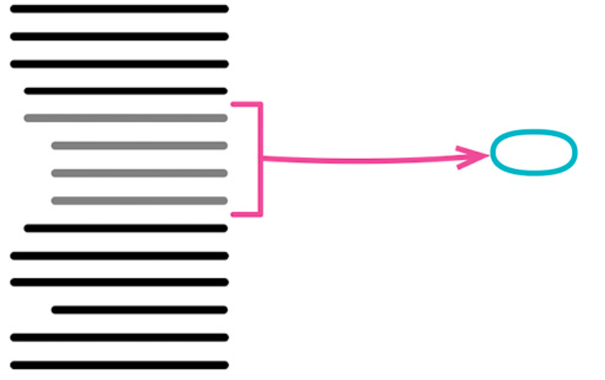
#### 无局部变量
这个就非常简单，直接抽取就行
#### 有局部变量
抽取完之后，将变量当作参数传就行
#### 对局部变量再赋值
需要拆分变量，将变量变为临时变量

### 内联函数(Inline Function)
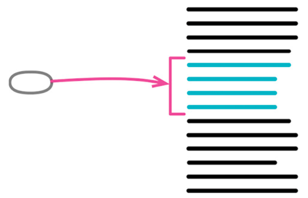

将一些不合理的小函数放到一个函数里，然后再次重构出合理的小函数
- 检查函数，确定它不具多态性。
> 如果该函数属于一个类，并且有子类继承了这个函数，那么就无法内联。
- 找出这个函数的所有调用点。
- 将这个函数的所有调用点都替换为函数本体。
- 每次替换之后，执行测试。
> 不必一次完成整个内联操作。如果某些调用点比较难以内联，可以等到时机成熟后再来处理。
- 删除该函数的定义。

### 提炼变量(Extract Variable)
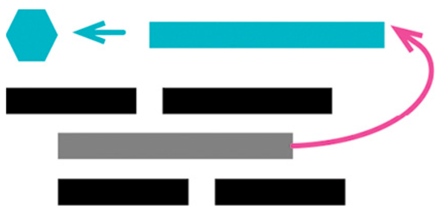
- 确认要提炼的表达式没有副作用。
- 声明一个不可修改的变量，把你想要提炼的表达式复制一份，以该表达式的结果值给这个变量赋值。 
- 用这个新变量取代原来的表达式。 
- 测试。

```js
// 修改前
function price(order) {
//price is base price - quantity discount + shipping 
return (
    order.quantity * order.itemPrice 
    - Math.max(0, order.quantity - 500) 
    * order.itemPrice * 0.05 
    + Math.min(order.quantity * order.itemPrice * 0.1, 100)
); }

// 修改后
function price(order) {
    const basePrice = order.quantity * order.itemPrice; 
    const quantityDiscount = Math.max(0, order.quantity - 500) * order.itemPrice * 0.05; 
    const shipping = Math.min(basePrice * 0.1, 100);
    return basePrice - quantityDiscount + shipping;
}
```

### 内联变量(Inline Variable)
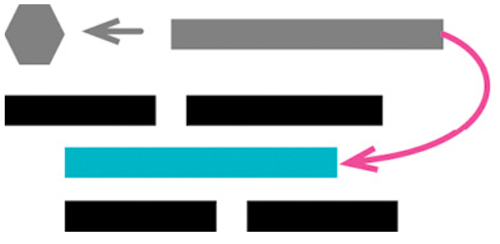

- 检查确认变量赋值语句的右侧表达式没有副作用。 
- 如果变量没有被声明为不可修改，先将其变为不可修改，并执行测试。 
> 这是为了确保该变量只被赋值一次。
- 找到第一处使用该变量的地方，将其替换为直接使用赋值语句的右侧表达式。
- 测试。
- 重复前面两步，逐一替换其他所有使用该变量的地方。
- 删除该变量的声明点和赋值语句。
- 测试。

```js
// 修改前
let basePrice = anOrder.basePrice; 
return (basePrice > 1000);

// 修改后
return anOrder.basePrice > 1000;
```

### 改变函数声明(Change Function Declaration)
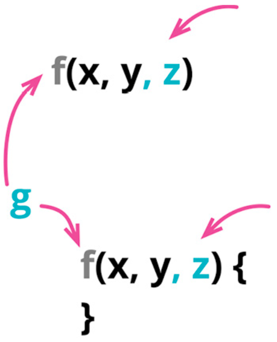

修改函数名字，修改函数参数，修改函数参数列表

- 如果想要移除一个参数，需要先确定函数体内没有使用该参数。 
- 修改函数声明，使其成为你期望的状态。 
- 找出所有使用旧的函数声明的地方，将它们改为使用新的函数声明。 
- 测试。 
- 最好能把大的修改拆成小的步骤，所以如果你既想修改函数名，又想添加参数，最好分成两步来做。(并且，不论何时，如果遇到了麻烦，请撤销修改，并改用迁移式做法。)

### 封装变量(Encapsulate Variable)
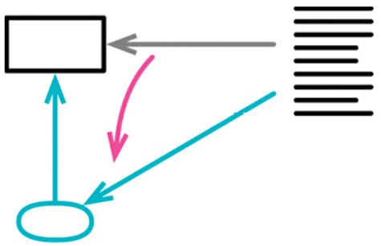

将数据进行封装
```js
// 修改前
let defaultOwner = { firstName: "Martin", lastName: "Fowler" };

// 修改后
let defaultOwnerData = { firstName: "Martin", lastName: "Fowler" }; 
export function defaultOwner() {return defaultOwnerData; }
export function setDefaultOwner(arg) { defaultOwnerData = arg;}
```
- 创建封装函数，在其中访问和更新变量值。
- 执行静态检查。 
- 逐一修改使用该变量的代码，将其改为调用合适的封装函数。每次替换之后，执行测试。 
- 限制变量的可见性。
> 有时没办法阻止直接访问变量。若果真如此，可以试试将变量改名，再执行测试，找出仍在直接使用该变量的代码。
- 测试。 
- 如果变量的值是一个记录，考虑使用封装记录

### 变量改名(Rename Variable)
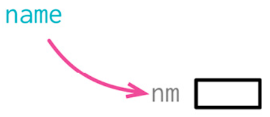

让变量名字有意义
```js
// 修改前
let a = height * width;

// 修改后
let area = height * width;
```

### 引入参数对象(Introduce Parameter Object)
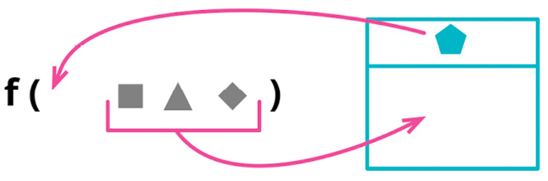

将数据组织成结构是一件有价值的事，因为这让数据项之间的关系变得明晰。使用新的数据结构，参数的参数列表也能缩短。并且经过重构之后，所有使用该数据结构的函数都会通过同样的名字来访问其中的元素，从而提升代码的一致性。
```js
// 修改前
function amountInvoiced(startDate, endDate) {...} 
function amountReceived(startDate, endDate) {...} 
function amountOverdue(startDate, endDate) {...}

// 修改后
function amountInvoiced(aDateRange) {...} 
function amountReceived(aDateRange) {...} 
function amountOverdue(aDateRange) {...}
```

### 函数组合成类(Combine Functions into Class)
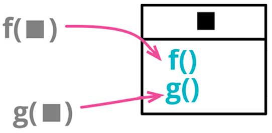


```js
// 修改前
function base(aReading) {...}
function taxableCharge(aReading) {...} 
function calculateBaseCharge(aReading) {...}

// 修改后
class Reading {
    base() {...} 
    taxableCharge() {...} 
    calculateBaseCharge() {...}
}
```

### 函数组合成变换(Combine Functions into Transform)
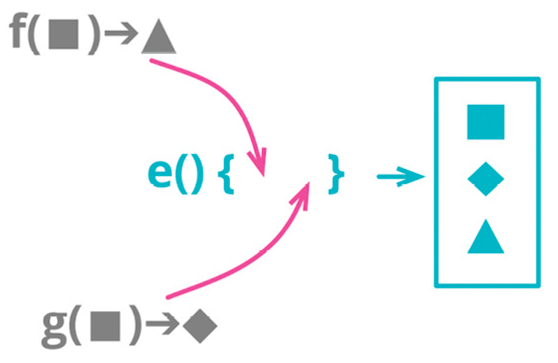

```js
// 修改前
function base(aReading) {...}
function taxableCharge(aReading) {...}

// 修改后
function enrichReading(argReading) {
    const aReading = _.cloneDeep(argReading); 
    aReading.baseCharge = base(aReading); 
    aReading.taxableCharge = taxableCharge(aReading); 
    return aReading;
}
```

### 拆分阶段(Split Phase)
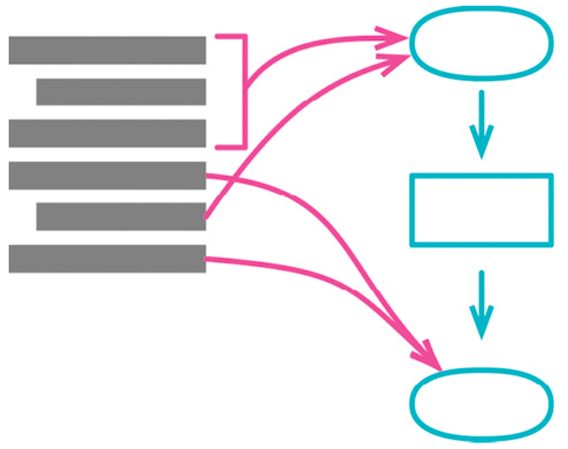

```js
// 修改前
const orderData = orderString.split(/\s+/);
const productPrice = priceList[orderData[0].split("-")[1]]; 
const orderPrice = parseInt(orderData[1]) * productPrice;

// 修改后
const orderRecord = parseOrder(order);
const orderPrice = price(orderRecord, priceList);
function parseOrder(aString) {
    const values = aString.split(/\s+/); 
    return {
        productID: values[0].split("-")[1],
        quantity: parseInt(values[1]), 
    };
}
function price(order, priceList) {
    return order.quantity * priceList[order.productID]; 
}
```

## 封装

### 封装记录(Encapsulate Record)
以数据类取代记录(Replace Record with Data Class)
```js
// 修改前
organization = { name: "Acme Gooseberries", country: "GB" };

// 修改后

class Organization { constructor(data) {
    this._name = data.name;
    this._country = data.country; }
    get name() {
        return this._name;
    }
    set name(arg) {
        this._name = arg; }
    get country() {
        return this._country;
    }
    set country(arg) {
        this._country = arg; }
}
```

### 封装集合(Encapsulate Collection)
```js
// 修改前
class Person {
    get courses() {
        return this._courses;
    }

    set courses(aList) {
        this._courses = aList;
    }
}

// 修改后
class Person {
    get courses() {return this._courses.slice();} 
    addCourse(aCourse) { ... } 
    removeCourse(aCourse) { ... }
}
```

### 以对象取代基本类型(Replace Primitive with Object)
以类取代类型码(Replace Type Code with Class)

以对象取代数据值(Replace Data Value with Object)
```js
// 修改前
orders.filter(o => "high" === o.priority || "rush" === o.priority);

// 修改后
orders.filter(o => o.priority.higherThan(new Priority("normal")))
```

### 类操作
#### 抽取类
#### 内联类
#### 隐藏委托关系(Hide Delegate)
如果某些客户端先通过服务对象的字段得到另一个对象(受托类)，然后调用后者的函数，那么客户就必须知晓这一层委托关系。万一受托类修改了接口，变化会波及通过服务对象使用它的所有客户端。

我可以在服务对象上放置一个简单的委托函数，将委托关系隐藏起来，从而去除这种依赖。这么一来，即使将来委托关系发生变化，变化也只会影响服务对象，而不会直接波及所有客户端。

- 对于每个委托关系中的函数，在服务对象端建立一个简单的委托函数。
- 调整客户端，令它只调用服务对象提供的函数。每次调整后运行测试。
- 如果将来不再有任何客户端需要取用 Delegate(受托类)，便可移除服务对象中的 相关访问函数。
#### 移除中间人(Remove Middle Man)
很难说什么程度的隐藏才是合适的。还好，有了隐藏委托关系和删除中间人，我大可不必操心这个问题，因为我可以在系统运行过程中不断进行调整。

随着代码的变化，“合适的隐藏程度”这个尺度也相应改变。6个月前恰如其分的封装，现今可能就显得笨拙。

重构的意义就在于:你永远不必说对不起——只要把出问题 的地方修补好就行了。

### 替换算法(Substitute Algorithm)

```js
// 修改前
function foundPerson(people) {
    for(let i = 0; i < people.length; i++) {
        if (people[i] === "Don") { return "Don";
        }
        if (people[i] === "John") {
            return "John"; }
        if (people[i] === "Kent") { return "Kent";
        } }
    return ""; 
}
// 修改后
function foundPerson(people) {
    const candidates = ["Don", "John", "Kent"];
    return people.find(p => candidates.includes(p)) || '';
}
```


