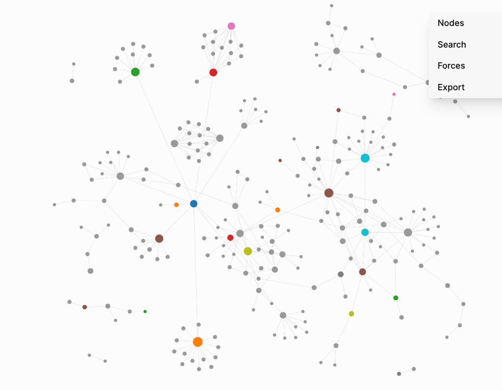
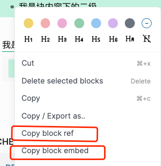

## [Logseq](https://logseq.com/)

**非常非常**优秀的知识管理工具，也可以拿来做笔记，日常工作任务，数据积累，项目文档存储等等

免费，代码开源，数据可以完全保存在本地，插件平台的支持

如果你不懂一点代码，那你只需要学习一点点markdown文档编辑模式的规则就可以徜徉在logseq的世界

如果你懂得mod or plugin的理念，那么你打开了logseq新的世界

如果你懂一点点git，你就可以将你的文档上传到github，实现云端保存

如果你懂一点点GithubPages，你就可以将你的文档部署在GitHubPages, 以网页的形式，任何人都可以浏览，输入地址随时都可以浏览

总之，尝试去使用它吧。

### 基础的概念

#### page
一篇记录或者一篇文档或者一篇目录或者单个存在的个体都可以视为page

page可以通过`[[page-name]]` 这个形式去引用，内嵌在其他的page内

也可以通过`#page-name`的形式去形成一个属性为tag的page，这个page里面会存在的block(内容块)

通过不同的引用链接，就可以生成一个 graph view 

#### block
一个块内容，块内容

在page里面，块内容就是核心内容，每一行就是一个块

通过插件[logseq-plugin-mark-map](https://github.com/vipzhicheng/logseq-plugin-mark-map)，我们能够生成这个page下所有的块层级

每个块都有一个独立的id，我们可以引用这个块，或者直接嵌入这个块

copy block ref

copy block embed

还有很多操作，需要实践出真知

### 常用快捷键

#### tt 改变主题（白天/黑夜）
#### tl 拉出左边栏
#### tr 拉出右边栏
#### ts 拉出设置菜单
#### tp 拉出插件菜单
#### command + K 搜索页面
#### command + Shift + p 常见命令行
#### command + [ 上一个页面
#### command + ] 下一个页面

块操作

#### option + ⬇️ or ⬆️ 选中某一个块