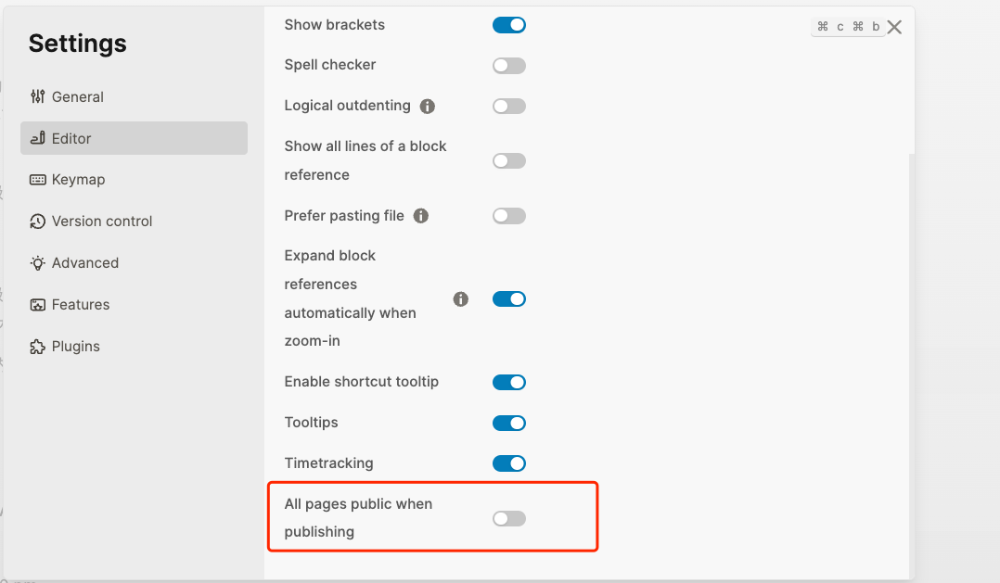
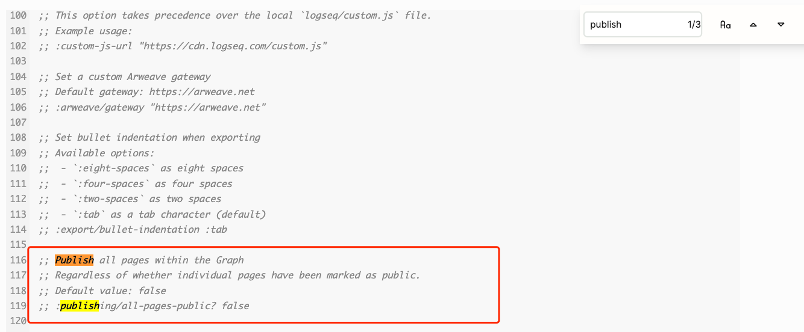
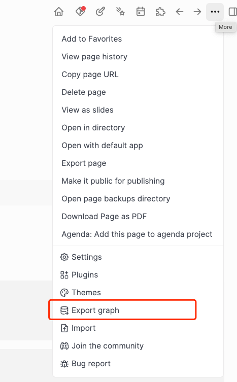
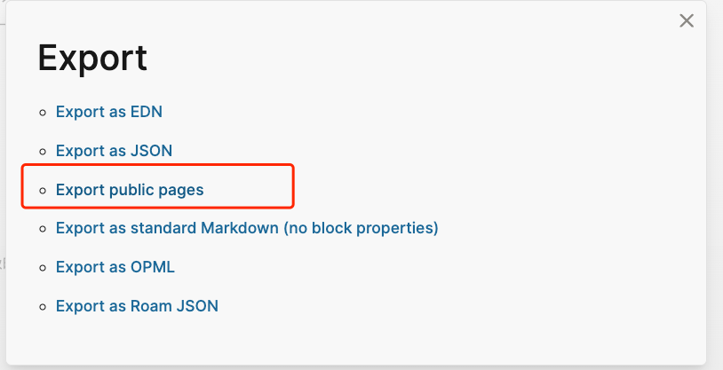
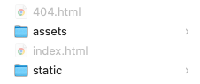
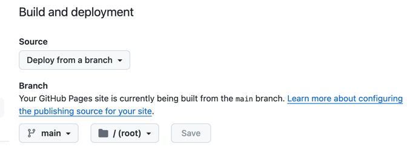
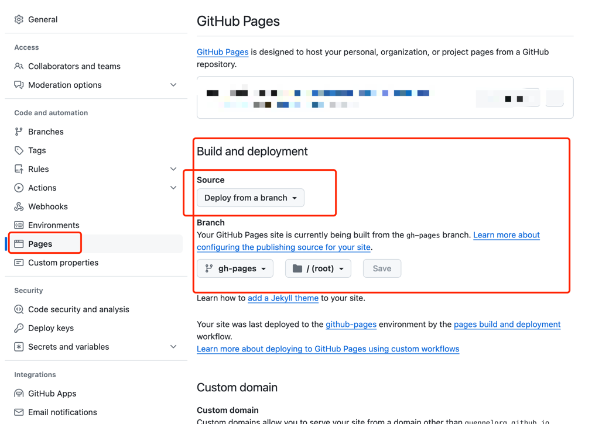

## [Logseq](/quennelBlog/blog/logseq)

### 确保这个文档是public
首先要确保logseq中所有的page是public

方案1:


方案2:
去这个页面 `config.edn`, 找到`publish`




增加这个`:publishing/all-pages-public? true`

### 方案一：本地编译成静态文件

点击Export graph


点击Export Public pages


这时候选中一个文件夹来保存编译完成的静态文件

生成的目录文件：


这时候就可以将这个文件夹push到github，然后在page设置中选中代码的分支


之后等一会github会自动部署，这样的部署是最基础的部署，不推荐这种部署方式，接下来我们用github action来定制我们的部署流程

静态文件已经编译完成后，无论是部署到vercel，或者其他的静态网页host都是可以
### 方案二：Github Action编译
这里我们引入 Github Action，有两种思路
- 一种是编写workflow负责编译，部署交给github默认分支gh-pages部署
- 一种是编写workflow负责编译+部署

#### workflow负责编译

仓库默认部署分支设置：


编译workflow

yaml:
```yaml
# This is a basic workflow to help you get started with Actions

name: CI

# Controls when the workflow will run
on:
  push:
    branches: [main]

  # Allows you to run this workflow manually from the Actions tab
  workflow_dispatch:

# A workflow run is made up of one or more jobs that can run sequentially or in parallel
jobs:
  # This workflow contains a single job called "build"
  build:
    # The type of runner that the job will run on
    runs-on: ubuntu-latest

    # Steps represent a sequence of tasks that will be executed as part of the job
    steps:
      # Checks-out your repository under $GITHUB_WORKSPACE, so your job can access it
      - uses: actions/checkout@v3
      - name: Logseq Publish 🚩
        uses: logseq/publish-spa@v0.3.0
      - name: add a nojekyll file
        run: touch $GITHUB_WORKSPACE/www/.nojekyll
      - name: Deploy 🚀
        uses: JamesIves/github-pages-deploy-action@v4
        with:
          branch: gh-pages # The branch the action should deploy to.
          folder: www # The folder the action should deploy.
          clean: true
          single-commit: true
```

#### 编写workflow负责编译+部署
这个策略不需要选定部署分支，一切交给workflow
