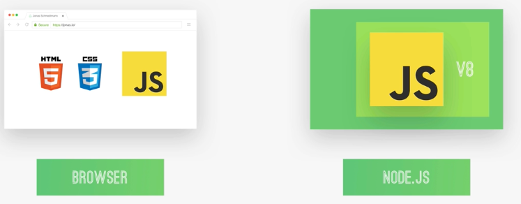

## [NodeJS](https://nodejs.org/en)

根据官方描述，nodeJS是一个javascript的运行环境，通过nodeJS编译javascript，我们可以起一个后端应用，比如http服务，这个环境是开源，跨平台的

了解到这，第一反应就是这跟JVM是一个样的作用，JVM是Java的运行环境，nodeJS是javascript的运行环境。

运行环境：编程语言能够运行的环境，其中包含编程语言所需的资源和工具（直接跟操作系统，磁盘进行操作，网络通信）

JavaScript除了通过nodeJS运行外，最常见甚至最开始是在浏览器中运行，用来操作document元素，通常被称为脚本代码。

在读大学的时候，html，css，js统称为前端，随着前端框架的发展更注重于快速实现需求，而不是重复的造轮子，之后还是要多研究下原理

### 编写原理
Node.js主要是用c和c++编写，通过c和c++可以跟操作系统，磁盘等交互，也就是c/c++作为底层操作，javascript调用c/c++的暴露出去的方法，这样NodeJS环境就搭起来了

NodeJS的主要组件：
- V8引擎
- libuv库
- 其他库等

源码解析：(https://theanarkh.github.io/understand-nodejs/)

### JVM和NodeJS有什么区别和类似点？

#### 相似点
- 跨平台，这些环境都可以在mac，windows，linux系统运行
- 生态系统，大量的三方框架，开源库，工具等

#### 不同点
- jvm运行java，nodejs运行javascript
- 能力不一样，javascript是单线程语言，java是多线程
- 实现方式和内存管理都不一样
  - js 事件驱动，异步I/O，单线程
  - 多线程，同步机制等
- JVM支持Java，kotlin，scala，groovy，nodejs支持javascript，通过工具（babel，typescript），也支持转译语言