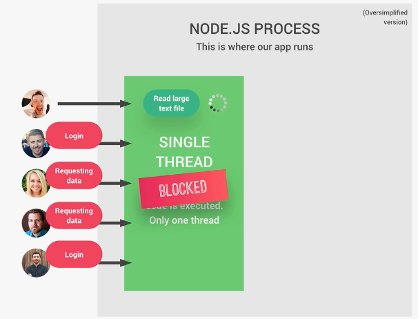
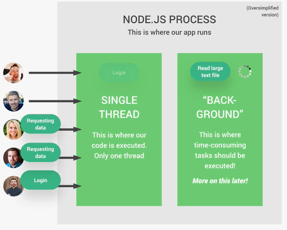

[Understand Node JS Single Thread Event Loop Work Flow](https://www.nextgenerationautomation.com/post/understand-node-js-single-thread-event-loop-work-flow)

[Nodejs单线程为什么能支持高并发？](https://www.zhihu.com/tardis/zm/art/61807318?source_id=1003)

### 同步与异步 synchronous VS asynchronous

#### 同步 如果某一个操作耗时严重，会阻塞代码

example1:

```js
const fs = require('fs');

// blocking code execution
const input = fs.readFileSync('./txt/input.txt', 'utf-8')
console.log(input)
```

example2:

第一个用户如果是耗时的操作，那么只有这个操作结束之后，接下来的用户才能继续操作，这个操作也被叫做阻塞操作


#### 异步 如果某一个操作耗时严重也不会阻塞代码，先执行主线程，再执行callback
```js
const fs = require('fs');

// Nonblocking code execution
fs.readFile('./txt/input.txt', 'utf-8', (err,data) => {
    console.log(data)
})
console.log('Reading file....')
```

example2:

如果是用callback的方式去执行耗时操作，那么主线程无需等待耗时操作结束


这个就是非阻塞的IO模型

NodeJS会有很多callback，但是callback的function并不完全等于异步

因为callback太多会面临回调地狱的问题：

```js
const fs = require('fs');

fs.readFile('./txt/input.txt', 'utf-8', (err,data) => {
    fs.readFile(`${data}.txt`, 'utf-8', (err,data2) => {
        fs.readFile(`${data3}.txt`, 'utf-8', (err,data4) => {
            fs.writeFile(`final.txt`,`${data2} ${data3} ${data4}`, 'utf-8', (err) => {
                if (err) throw err;
                console.log('Your file has been saved :D');
            });
        });
    });
});
console.log('Write file....');
```

因此可以用 Promises or Asynsc/Await来解决