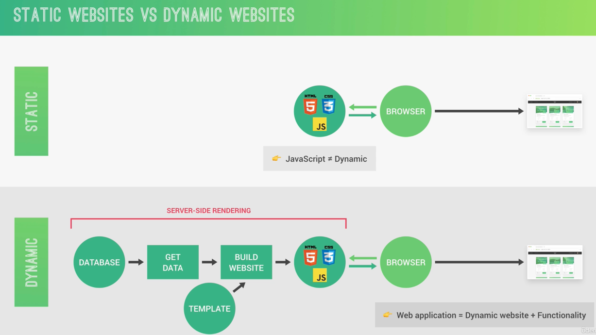
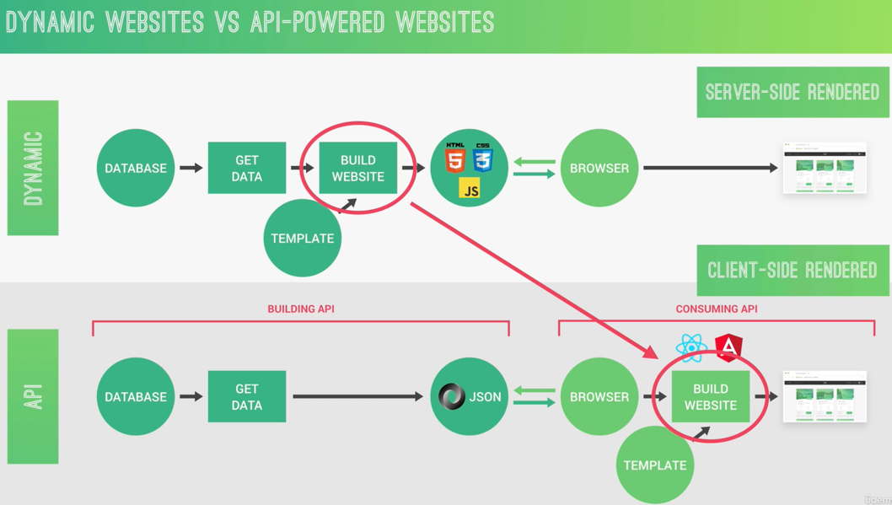
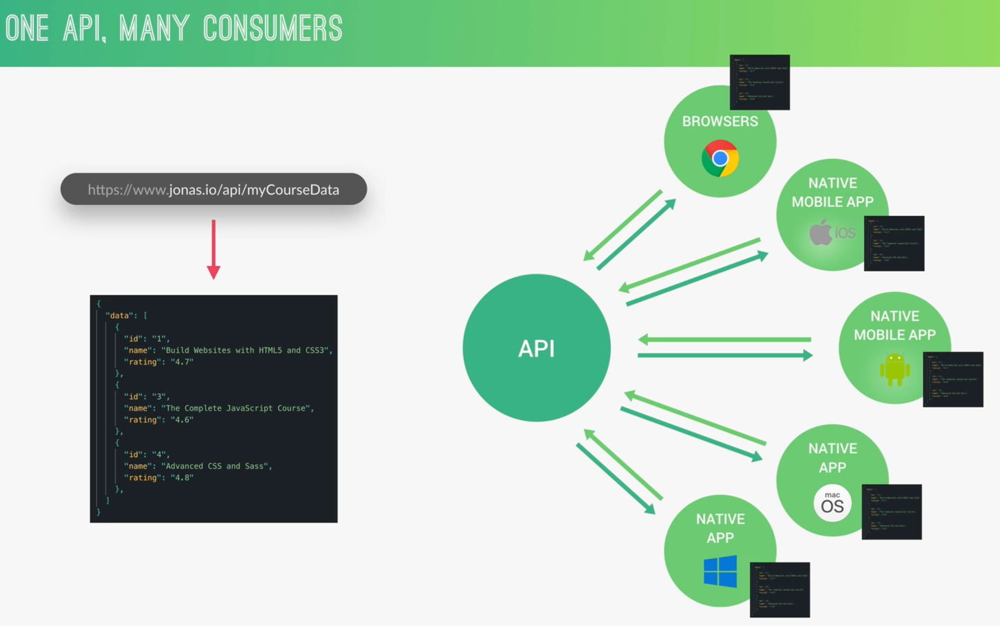

## [Sample NodeJS Simple Application](https://github.com/quennelorg/expressJSMongodb/tree/main/work/1-node-farm/starter)

## HTTP服务器
```js
const http = require('http');

// 创建一个 HTTP 服务器
const server = http.createServer((req, res) => {
  // 设置响应头部信息和状态码
  res.writeHead(200, {'Content-Type': 'text/plain'});
  
  // 发送响应数据
  res.end('Hello, world!\n');
});

// 监听端口 3000
server.listen(3000, () => {
  console.log('Server is running at http://localhost:3000/');
});
```

### http.createServer
`http.createServer` 是 Node.js 内置 http 模块的一部分，用于创建一个 HTTP 服务器

这个服务器能够接收和处理 HTTP 请求，并发送 HTTP 响应。`http.createServer` 是构建网络应用程序和 API 的基础工具之一

- `http.createServer([requestListener])`:
    - `requestListener` 是一个回调函数，在每次接收到请求时都会被调用。它有两个参数：`req` 和 `res`，分别代表请求对象和响应对象。
- `req` 对象:
  - 包含了请求的详细信息，例如 HTTP 方法、请求头、URL 等。
- `res` 对象:
  - 用于构建和发送 HTTP 响应。常用的方法有 `writeHead(statusCode, headers)` 设置响应头部信息，`write(data)` 发送响应主体数据，以及 `end([data])` 结束响应。


### server.listen

使用 `server.listen(port, [hostname], [backlog], [callback])` 方法，让服务器开始监听特定的端口。例如：`server.listen(3000)` 使服务器在本地的 3000 端口上监听。

### handle router
根据 `req.url `判断请求路径，执行不同的处理逻辑:

```js
const server = http.createServer((req, res) => {
  if (req.url === '/') {
    res.writeHead(200, {'Content-Type': 'text/plain'});
    res.end('Home Page');
  } else if (req.url === '/about') {
    res.writeHead(200, {'Content-Type': 'text/plain'});
    res.end('About Page');
  } else {
    res.writeHead(404, {'Content-Type': 'text/plain'});
    res.end('Page Not Found');
  }
});
```

## SSR（Server-Side Rendering）

[vue服务端渲染](https://cn.vuejs.org/guide/scaling-up/ssr.html)

刚开始听这个概念，就觉得很高大上，但是实际了解过后，有种感觉，怎么技术发展得倒退了。

依稀记得在刚读大学的时候，从Java开始学习，那时候接触到的前端只有html，css，js，jquery，
然后主要是这些技术只是为了服务JSP，通过Java的JSP来实现html和后端数据混合，html可以加载Java的字段，这样通过学习Servlet，以及后来的struts2框架来开发整个应用，tomcat来启动服务器，mysql作为数据库，
那个时候毕设就是设计一个英语学习管理平台系统，就是通过上述流程创建一个Java应用。在那个时候，还没有前端框架，前后端也没有分离，现在回想起来，时间过的好快，技术更新的速度也太快了，35岁之后还能跟得上时代吗？

回到主题，之前的JSP也就是在服务器端生成的动态网页，也就是服务器端生成html，然后再交给前端渲染

现在的前端框架是客户端通过js来渲染出html，服务器端只负责提供数据就行，当然无论是 SSR 还是 CSR， 关于用户操作的逻辑肯定是需要交给客户端的JS来完成

仔细想了下，大概有几个想法
- 服务器端渲染的部分肯定会比在客户端渲染所有部分省时间，特别是首页部分，有时候一些组件或者内容都是不会改变的，可以把这些部分交给服务器生成html，前端直接展示就行
- 服务器端返回html，对SEO来说的话肯定是一大利好，因为，SEO需要去抓取html来做索引和匹配，如果是CSR，那么SEO抓取到的只是初始的html骨架和js文件，剩余部分有js来动态加载，SEO肯定不知道内容，但是如果是SSR渲染，那么SEO就知道这个页面所有内容，因此很简单的就可以被搜索到
- SSR对服务器端的负担比较重，毕竟把生成html放在服务器端了，能不重吗，CSR还能白嫖客户端的资源，不过[vercel](https://vercel.com/)和[next.js](https://nextjs.org/)的高度融合，似乎可以提供一个很好的解决方案
- 现在基本上没有单独的SSR，因为总有一些操作需要放到客户端，因此SSR跟CSR的融合似乎还是有很多很多坑
  - 印象中路由问题是一个大问题，因为服务器端可以有自己的路由系统，客户端也有自己的路由系统，那么处理不当就会有路由和导航的问题
  - 生命周期，服务器端是不感知客户端浏览器组件的生命周期，因此，react的很多方法并不能在服务器端调用


## static Websites Vs dynamic Websites



## dynamic Websites Vs API-Powered Websites



## One API, Many Consumers
