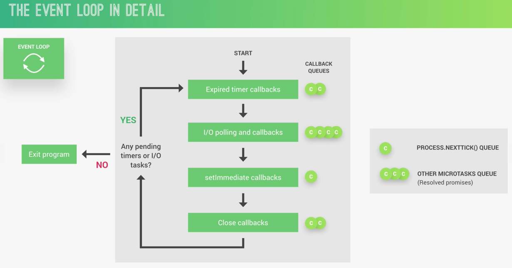
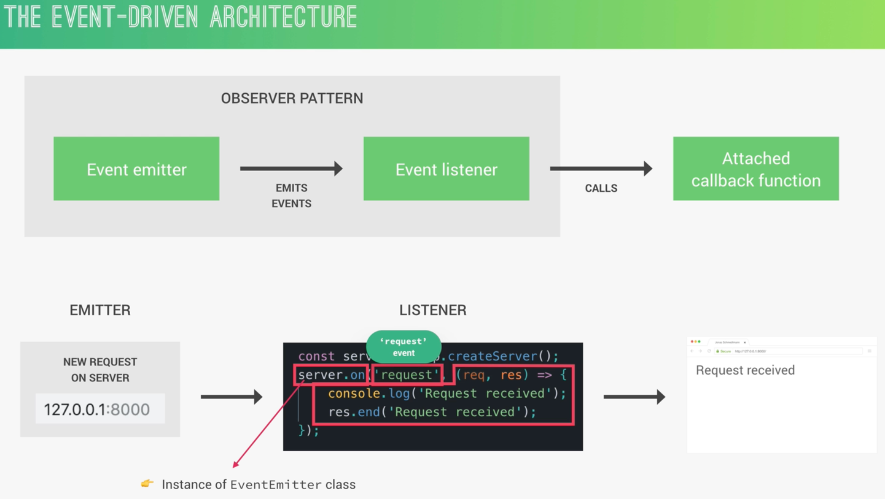
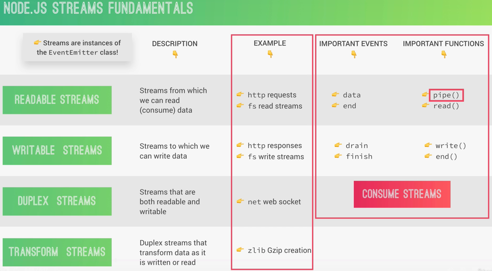

[Node.js 源码剖析](https://theanarkh.github.io/understand-nodejs/chapter00-%E5%89%8D%E8%A8%80/)

[《深入理解Node.js：核心思想与源码分析》](https://github.com/yjhjstz/deep-into-node)

## Simple Architecture


## Process And Threads


## Event Loop



[一看就懂的事件循环机制(event loop)](https://juejin.cn/post/7002037475874963493)

## Event-Driven Architecture
基于observer, 服务起了之后，就一直在listen


## Stream 流式传输，让数据可以一块一块的传输

YouTube，netflix

- Readable（可读流）：从中读取数据的流。例如，文件读取流、HTTP 响应流
- Writable（可写流）：向其写入数据的流。例如，文件写入流、HTTP 请求流
- Duplex（双工流）：同时可读可写的流。例如，网络套接字
- Transform（转换流）：在读写过程中可以修改或转换数据的流。例如，压缩、解压缩流


### 好处：
#### 节省内存，
毕竟流式传输，不需要一次性的把所有数据处理好再加载到内存。

如果数据太大，内存消耗过多，还会有溢出的危险，如果用流的话，在上述问题发生的时候，已经有一部分数据可以得到保留
#### 提高性能
节省了内存肯定能够提高性能，流的逐块处理和非阻塞 I/O 特性使得数据处理更高效。它减少了等待时间，并允许其他任务在数据传输过程中进行处理，提高了整体性能
#### 非阻塞 I/O
Node.js 的流是基于事件驱动和异步的，这意味着 I/O 操作不会阻塞主线程。流通过事件和回调机制来处理数据，确保应用程序可以同时处理多个 I/O 操作
#### 管道 数据转换
pipe这个方法是太好用了，让数据在中间过程就可以得到处理，这个在响应式编程中，用的最多


### backpressure 背压
在流式传输中，如果生产者的能力太强，消费者的能力太弱，就会导致消费者数据崩溃，消失等问题

在下面的例子中，一个读取文件的流（生产者）可能比写入网络请求的流（消费者）更快，如果没有背压机制，那么消费者可能会被数据淹没，从而导致内存溢出或系统崩溃

#### 背压的工作原理
背压通过控制数据流动来解决上述问题，确保生产者不会在消费者忙于处理之前生成更多的数据。具体实现机制因不同平台和框架而异，但通常包括以下几种方式

- 暂停和恢复：当消费者无法处理更多数据时，通知生产者暂停数据生产，直到消费者有能力继续处理数据时再恢复生产
- 缓冲区：使用缓冲区暂时存储生产者生成的数据，当消费者处理完当前数据后，再从缓冲区中取出新的数据
- 丢弃数据：在某些情况下，当消费者处理能力不足时，可以选择丢弃一部分数据，以防止系统过载


NodeJS中，pipe的方法会自动处理背压，也可以手动处理背压


### implement example
```js
const fs = require('fs')
const server = require('http').createServer();


server.on('request', (req, res) => {
    // Solution 1
    // fs.readFile('test-file.txt', (err, data) => {
    //     if(err) console.log(err);
    //     res.end(data)
    // })

    // Solution 2: Streams
    // const readable = fs.createReadStream('test-file.txt')
    // readable.on('data', chunk => {
    //     res.write(chunk)
    //     // 一块一块的发数据
    // })
    // readable.on('end', () => {
    //     res.end();
    // })
    // readable.on('error', err => {
    //     console.log(err);
    //     res.statusCode = 500
    //     res.end('File not found')
    // })

    // Solution 3: pipe backpressure
    const readable = fs.createReadStream('test-file.txt')
    readable.pipe(res);
    // readableSource.pipe(writeableDest)
    
})


server.listen(8000, '127.0.0.1', () => {
    console.log('Server listening')
})


```