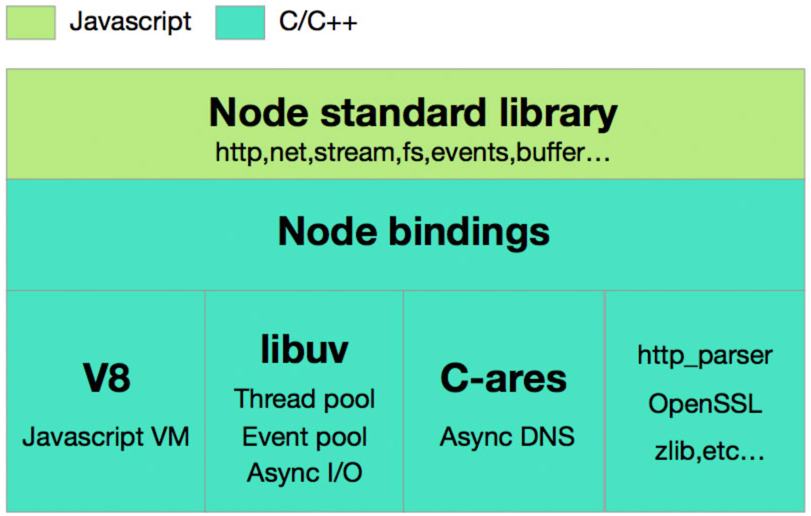
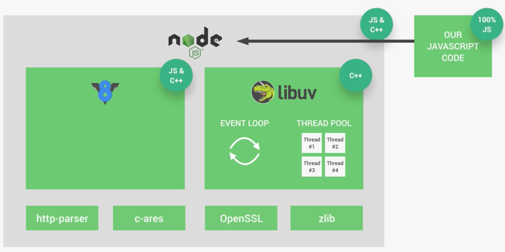
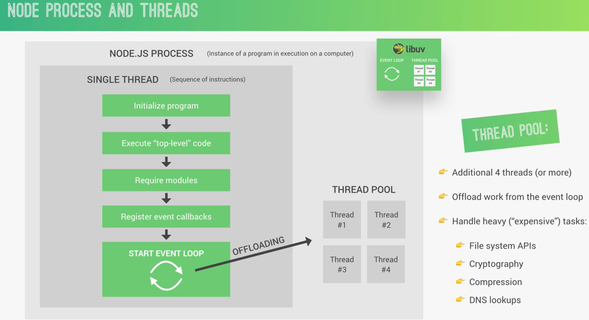
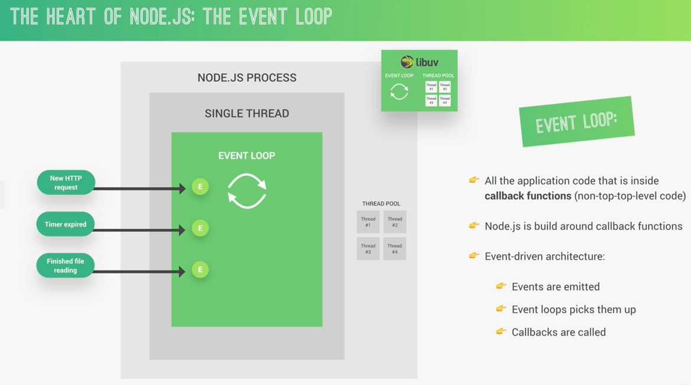

[Node.js 源码剖析](https://theanarkh.github.io/understand-nodejs/chapter00-%E5%89%8D%E8%A8%80/)

[《深入理解Node.js：核心思想与源码分析》](https://github.com/yjhjstz/deep-into-node)

## Simple Architecture

## Process And Threads

## Event Loop

[一看就懂的事件循环机制(event loop)](https://juejin.cn/post/7002037475874963493)

