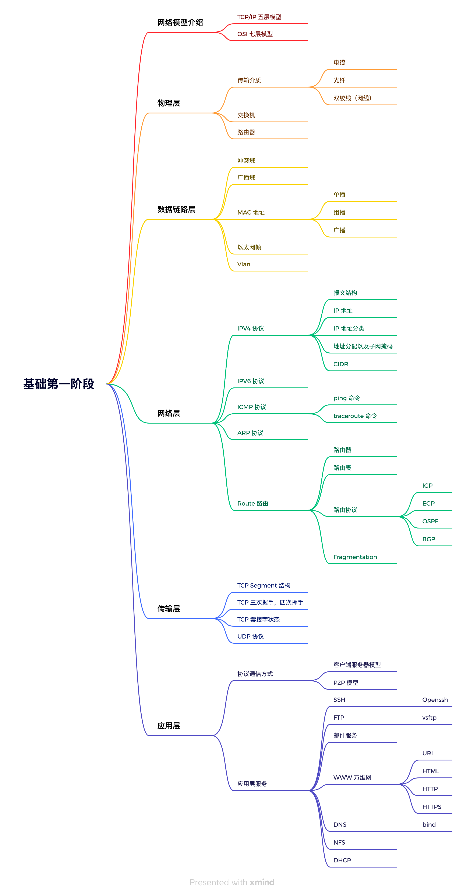

## 协议栈
操作系统中的协议栈是指在计算机网络通信中负责处理不同网络协议的一组软件层级结构。

协议栈提供了一个层级化的网络通信模型，使得不同层级的协议可以独立设计、实现和维护，同时提供了一种标准的接口，使得不同厂商的设备和软件能够互相通信。

在实际通信过程中，数据在不同层级之间经过封装和解封装的过程，从应用层到物理层逐层传输，最终到达目标设备

它通常被称为 **OSI** 模型或 **TCP/IP** 模型

#### 如果没有这些模型
网络之间的通信也是能够运行，但是网络两个节点之间并没有互相规定的设计，因此网络的设计与管理就非常复杂，网络的拓展性也相当于没有，每个点都有自己的规则，如何去形成统一的通信方式

标准这个东西很重要，伟大的公司做标准，只有制定了标准，就意味着被永远铭记

- 这些模型的出现简化了网络通信的设计和实现
- 明确的层级结构能够让问题的诊断更加清晰
- 不同系统之间可以使用相同的协议进行通信

### OSI（Open Systems Interconnection）
[OSI Model](https://www.practicalnetworking.net/series/packet-traveling/osi-model/)

#### 物理层（Physical Layer）
- 负责传输比特流，处理物理介质上的数据传输
- 例子：在网络通信中，光纤、电缆、无线电波等物理介质用于传输比特流
#### 数据链路层（Data Link Layer）
- 处理帧的传输和错误检测，将比特流转换为数据帧
- 例子：以太网协议（Ethernet）在数据链路层负责帧的传输和错误检测
#### 网络层（Network Layer）
- 处理数据包的路由和转发，提供端到端的数据传输
- 例子：IP 协议负责在网络层处理数据包的路由和转发，确保数据从源主机传输到目标主机
#### 传输层（Transport Layer）
- 提供端到端的数据传输，确保数据的可靠性和完整性
- 例子：TCP 协议在传输层负责可靠的数据传输，例如，确保数据包按顺序到达、不丢失，并在需要时进行重传
#### 会话层（Session Layer）
- 管理会话的建立、维护和结束，提供数据的同步和复位
- 会话层协议可以负责会话的建立和维护，以确保通信的稳定性和可靠性
#### 表示层（Presentation Layer）
- 负责数据的格式化、编码和加密，确保不同系统间的数据能够正确解释
- 例子：压缩算法、加密协议等在表示层负责数据的格式化和安全传输
#### 应用层（Application Layer）
- 为用户提供网络服务和应用，如HTTP、FTP等
- 例子：HTTP 协议在应用层负责Web服务，FTP协议负责文件传输服务，SMTP协议负责电子邮件传输等

### TCP/IP Transmission Control Protocol/Internet Protocol
#### 网络接口层（Network Interface Layer）
相当于 OSI 模型中的物理层和数据链路层
#### 网络层（Internet Layer）
相当于 OSI 模型中的网络层
#### 传输层（Transport Layer）
相当于 OSI 模型中的传输层
#### 应用层（Application Layer）
相当于 OSI 模型中的应用层，但更加宽泛，包含了 OSI 模型中的会话层和表示层

## 网络基础
