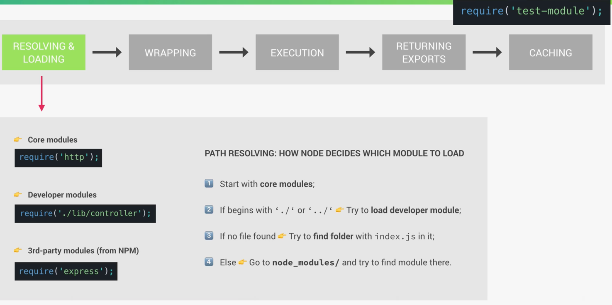

## [CommonJs Modules](https://nodejs.org/docs/latest/api/modules.html#modules-commonjs-modules)

### resolving loading

#### 导入当前自定义文件模块
```js
// 相对路径：使用 ./ 或 ../ 表示相对于当前文件的路径
const module = require('./relative/path/to/module');

// 绝对路径：直接从文件系统的根路径开始
const module = require('/absolute/path/to/module')
```

#### 导入核心模块
```js
const fs = require('fs');
const http = require('http');
const path = require('path');
```

#### 导入第三方模块，node_modules里面的内容，使用npm安装第三方模块之后就可以用模块名称导入
```js
const express = require('express');
const lodash = require('lodash');
```

require 会缓存已加载的模块。对于同一个模块的多次 require 调用，只会加载一次，并返回相同的模块实例

### [the-module-wrapper](https://nodejs.org/docs/latest/api/modules.html#the-module-wrapper)
每个模块的代码实际上被包装在一个特殊的函数中。这是 Node.js 模块系统的一部分，它确保每个模块都有自己独立的作用域，以避免全局变量冲突

```js
(function (exports, require, module, __filename, __dirname) {
    // 模块的代码
});
```

当 `Node.js` 加载一个模块时，它会将模块的代码包装在这个函数中，然后调用这个函数。这个函数提供了几个局部变量，分别是 `exports`、`require`、`module`、`__filename` 和 `__dirname`

#### 例子：
这有个模块
```js
// math.js
exports.add = function(a, b) {
    return a + b;
};

exports.subtract = function(a, b) {
    return a - b;
};
```
Node.js 实际上会将这个文件的内容包装在一个函数中，如下所示

```js
(function (exports, require, module, __filename, __dirname) {
    exports.add = function(a, b) {
        return a + b;
    };

    exports.subtract = function(a, b) {
        return a - b;
    };
});
```

然后，Node.js 会调用这个包装函数，并传递相应的参数：

- `exports`：一个对象，用于将模块内容导出
- `require`：一个函数，用于导入其他模块
- `module`：一个对象，代表当前模块
- `__filename`：当前模块的绝对路径
- `__dirname`：当前模块所在目录的绝对路径
这些参数的作用
- `exports`：用于导出模块的公共接口。你可以将要导出的内容赋值给 exports 对象
- `require`：用于引入其他模块的函数
- `module`：代表模块自身，module.exports 是真正导出内容的地方。exports 是 module.exports 的一个引用
- `__filename`：当前模块的绝对路径
- `__dirname`：当前模块所在目录的绝对路径





## experiment

### log arguments
```js
console.log(arguments);

```

结果：
```js
/*
[Arguments] {
    '0': {},
    '1': [Function: require] {
        resolve: [Function: resolve] { paths: [Function: paths] },
        main: Module {
            id: '.',
                path: '/path/to/your/directory',
                exports: {},
            parent: null,
                filename: '/path/to/your/directory/example.js',
                loaded: false,
                children: [],
                paths: [Array]
        },
        extensions: [Object: null prototype] {
            '.js': [Function (anonymous)],
                '.json': [Function (anonymous)],
                '.node': [Function (anonymous)]
        },
        cache: [Object: null prototype] {}
    },
    '2': Module {
        id: '.',
            path: '/path/to/your/directory',
            exports: {},
        parent: null,
            filename: '/path/to/your/directory/example.js',
            loaded: false,
            children: [],
            paths: [
            '/path/to/your/directory/node_modules',
            '/path/to/node_modules',
            '/node_modules'
        ]
    },
    '3': '/path/to/your/directory/example.js',
        '4': '/path/to/your/directory'
}
 */
```

- `exports`: `{}` - 一个空对象，用于导出模块的内容。
- `require`: `[Function: require]` - 导入其他模块的函数，并包含一些子属性如 `resolve`、`main`、`extensions`、`cache`。
- `module`: `Module` 对象，表示当前模块。包含 `id`、`path`、`exports`、`parent`、`filename`、`loaded`、`children`、`paths` 等属性。
- `__filename`: `/path/to/your/directory/example.js` - 当前模块文件的绝对路径。
- `__dirname`: `/path/to/your/directory` - 当前模块所在目录的绝对路径。

### log module.wrapper
```js
console.log(require('module').wrapper);

// result:
// '(function (exports, require, module, __filename, __dirname) { ','\n});'

```

### module export and import

#### export1:
```js
// class Calculator {
//     add(a, b) {
//         return a + b
//     }
//     multiply(a, b) {
//         return a * b
//     }
//     divide(a, b) {
//         return a - b
//     }
// }
// module.exports = Calculator

module.exports = class {
    add(a, b) {
        return a + b
    }
    multiply(a, b) {
        return a * b
    }
    divide(a, b) {
        return a - b
    }
}
```

#### import1:
```js
const C = require('./test-module-1')

const calc1 = new C()

console.log(calc1.add(1,2))
```

#### export2:
```js
exports.add = (a,b) => a + b;
exports.multiply = (a, b) => a * b;
exports.divide = (a, b) => a / b;
```

#### import2:
```js
// const calc2 = require('./test-module-2')
const { add, multiply, divide } = require('./test-module-2')
// console.log(calc2.add(1,2))
console.log(add(1,2))
```

### caching

#### test-module-3.js
```js
console.log('hello from the module')

module.exports = () => console.log('Log this beautiful text')
```

```js
// caching
require('./test-module-3')();
require('./test-module-3')();
require('./test-module-3')();

/*
result:
hello from the module
Log this beautiful text
Log this beautiful text
Log this beautiful text
*/

```