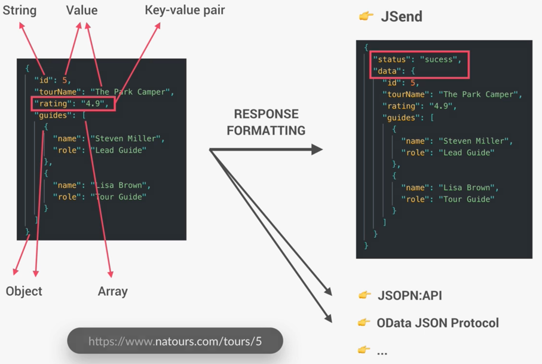

## API
[What is an API?](https://www.redhat.com/en/topics/api/what-are-application-programming-interfaces)

读研究生的时候，当时导师讲解了API，dataset的相关知识，那时候对开发的认知是spring，hibernate，structs，jsp，html，css，js，jquery等

完全不明白API是什么，为什么要有API，Application Programming Interface 代表着什么？

当时有个assignment就是基于API开发弄一个showcase，当时第一次探索到youtube各种课程，就随手搜了一个api+js small demo，最终按照上面的教程，做了一个展示当前天气的功能

现在回想起来，当时如果有chat-gpt多好啊，对知识的掌握就能够全面一些，在chatgpt之后的未来，人类该是有多强大，就好比网络出现的时候，那时候会如何畅想未来

当时，有些人做了机器识别的应用，用了google cloud 提供的机器学习api，提供照片，就能够识别，当时还在想，这算什么api应用，不就是调库吗，这谁不会呀，现在回想起来，这就是api应用呀，google cloud 提供了这个库的接口

一眨眼，时间过了好久，有些后悔当时没有好好珍惜，应该工作一段时间再去读书

现在的时光也要珍惜，以后再也回不到现在

API可以是一个接口，可以是一个协议，可以是一个工具，就看从哪个角度去理解，大概添加个定义：API是一个对外暴露出去的能力（接口），这个外和内可以是程序内组件，可以是外部程序和内部程序，也可以是操作系统和应用等

- Web API：基于 HTTP/HTTPS 协议，通常用于 web 服务，如 REST API 和 GraphQL
- 库/API：软件库中提供的 API，允许程序调用库中的功能
- 操作系统 API：提供对操作系统功能的访问，如文件系统、网络通信等
- 硬件 API：提供对硬件设备的访问，如图形处理单元（GPU）、传感器等

这里可以引用一个消费者和生产者的模式
- 消费者需要消费数据
- 生产者需要生产数据
那么
- 消费者通过什么能够接收到生产者的数据呢？ API 
- 消费者通过什么能够知道生产者的数据格式呢？ API
- 消费者通过什么能够感知生产者的数据状态呢？ API

## [REST API](https://restfulapi.net/)
[What is a REST API?](https://www.redhat.com/en/topics/api/what-is-a-rest-api)

- 资源导向：所有的内容都是资源，每个资源通过 URL 进行标识

- 统一接口：使用标准的 HTTP 方法进行操作（GET 获取资源，POST 创建资源，PUT 更新资源，DELETE 删除资源）

- 表示层分离：客户端与服务器之间的通信仅限于资源的表示，资源可以有不同的表示形式（如 JSON、XML）

- 无状态：每个请求都包含所有必要的信息，服务器不会保存客户端的状态

- 可缓存性：服务器可以明确标识响应是否可以缓存，以提高性能

