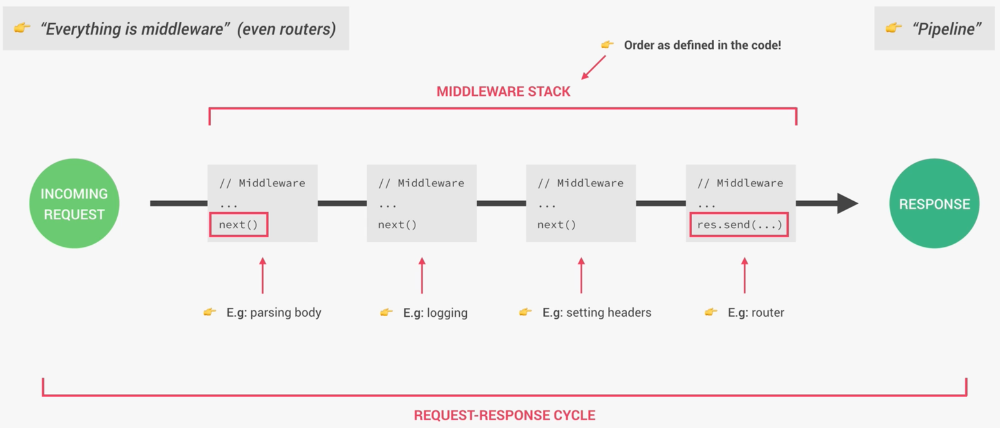

## 中间件

中间件这个名字有些术语化，不过中间这个含义是通俗易懂，没有加一层解决不了的事，这一层可以被成为中间件

中间件在express中或者其他框架中，是一个处理请求和回复之间的组件库，这个组件库可以有多个功能，比如身份验证，日志记录，数据格式转换等

中间件，顾名思义，处在请求到回复之间的中间位置，拦截请求和相应进行处理

突然想到，bff存在的模式就是一个大的中间件

### 功能
- 请求拦截
  - 身份验证
  - 日志记录
  - 数据验证
  - CORS处理
- 响应拦截
  - 数据格式转换，比如把某个字段做映射转换
  - 压缩，比如减少数据字段，合并到一个字段等
  - 错误处理，比如根据特定的错误code，进行映射，返回沟通好的错误信息


### express 示例
- 链式调用，每个中间件处理完请求后，将其传递给下一个中间件，直到请求到达最终处理程序。同样地，响应也会经过中间件链进行处理
- 可插拔性，开发者可以根据需要添加、移除或替换中间件，以实现不同的功能和特性

```js
const express = require('express');
const app = express();

// 定义一个简单的日志中间件
const logger = (req, res, next) => {
  console.log(`${req.method} ${req.url}`);
  next(); // 调用 next() 将请求传递给下一个中间件
};

// 使用日志中间件
app.use(logger);

// 定义一个路由处理程序
app.get('/', (req, res) => {
  res.send('Hello, World!');
});

// 启动服务器
app.listen(3000, () => {
  console.log('Server is running on http://localhost:3000');
});
```



### Django
Django中，也有中间件的概念，我们可以在 `settings.py` 文件中的 `MIDDLEWARE` 列表中配置

```python
# settings.py

MIDDLEWARE = [
    'django.middleware.security.SecurityMiddleware',
    'django.contrib.sessions.middleware.SessionMiddleware',
    'django.middleware.common.CommonMiddleware',
    'django.middleware.csrf.CsrfViewMiddleware',
    'django.contrib.auth.middleware.AuthenticationMiddleware',
    'django.contrib.messages.middleware.MessageMiddleware',
    'django.middleware.clickjacking.XFrameOptionsMiddleware',
    'myapp.middleware.CustomMiddleware',  # 自定义中间件
]

# myapp/middleware.py

from django.utils.deprecation import MiddlewareMixin

class CustomMiddleware(MiddlewareMixin):
    def process_request(self, request):
        print(f'Request path: {request.path}')

    def process_response(self, request, response):
        print('Response status:', response.status_code)
        return response

```
`CustomMiddleware` 会在请求处理前打印请求路径，并在响应处理后打印响应状态码


## Filter Incerceptor

中间件的概念其实也就是过滤器（Filter）和拦截器（Interceptor），在springboot中，过滤器和拦截器在请求处理链中提供了一种拦截和处理请求和响应的机制，可以用于日志记录、身份验证、数据验证等功能

过滤器与拦截器区别
- 层次不同：过滤器是 Servlet 层次的组件，在整个 Web 应用的最外层，所有的请求都会经过过滤器；拦截器是 Spring 层次的组件，只对经过 Spring MVC 处理的请求起作用
- 使用场景
  - 过滤器：适用于所有请求的统一处理，如编码设置、跨域处理、安全检查等
  - 拦截器：适用于业务逻辑相关的处理，如权限验证、日志记录、业务处理等

### 过滤器（Filter）
过滤器是在 Servlet 规范中定义的，用于在请求到达 Servlet 之前或响应返回客户端之前对请求和响应进行处理

#### 定义一个过滤器
```java
import javax.servlet.Filter;
import javax.servlet.FilterChain;
import javax.servlet.FilterConfig;
import javax.servlet.ServletException;
import javax.servlet.ServletRequest;
import javax.servlet.ServletResponse;
import javax.servlet.annotation.WebFilter;
import java.io.IOException;

@WebFilter(urlPatterns = "/*")
public class LoggingFilter implements Filter {

    @Override
    public void init(FilterConfig filterConfig) throws ServletException {
        // 初始化代码
    }

    @Override
    public void doFilter(ServletRequest request, ServletResponse response, FilterChain chain)
            throws IOException, ServletException {
        System.out.println("Request received at " + request.getRemoteAddr());
        chain.doFilter(request, response);
        System.out.println("Response sent to " + request.getRemoteAddr());
    }

    @Override
    public void destroy() {
        // 清理代码
    }
}

```

#### 注册过滤器
可以通过 `@WebFilter` 注解或在 `FilterRegistrationBean` 中进行注册。使用 `@WebFilter` 注解如上示例所示，或者在配置类中进行注册
```java
import org.springframework.boot.web.servlet.FilterRegistrationBean;
import org.springframework.context.annotation.Bean;
import org.springframework.context.annotation.Configuration;

@Configuration
public class FilterConfig {

    @Bean
    public FilterRegistrationBean<LoggingFilter> loggingFilter() {
        FilterRegistrationBean<LoggingFilter> registrationBean = new FilterRegistrationBean<>();
        registrationBean.setFilter(new LoggingFilter());
        registrationBean.addUrlPatterns("/*");
        return registrationBean;
    }
}

```

### 拦截器（Interceptor）
拦截器是 Spring 框架中的一种机制，提供了在请求到达控制器之前和响应离开控制器之后处理请求的功能

#### 定义一个拦截器
```java
import org.springframework.stereotype.Component;
import org.springframework.web.servlet.HandlerInterceptor;
import org.springframework.web.servlet.ModelAndView;

import javax.servlet.http.HttpServletRequest;
import javax.servlet.http.HttpServletResponse;

@Component
public class LoggingInterceptor implements HandlerInterceptor {

    @Override
    public boolean preHandle(HttpServletRequest request, HttpServletResponse response, Object handler) throws Exception {
        System.out.println("Request URL: " + request.getRequestURL());
        return true; // 返回 true 继续处理请求，返回 false 取消请求
    }

    @Override
    public void postHandle(HttpServletRequest request, HttpServletResponse response, Object handler, ModelAndView modelAndView) throws Exception {
        System.out.println("Response Status: " + response.getStatus());
    }

    @Override
    public void afterCompletion(HttpServletRequest request, HttpServletResponse response, Object handler, Exception ex) throws Exception {
        System.out.println("Request and Response is completed");
    }
}

```
#### 注册拦截器
拦截器需要通过配置类进行注册，通常是继承 `WebMvcConfigurer` 并重写 `addInterceptors` 方法
```java
import org.springframework.beans.factory.annotation.Autowired;
import org.springframework.context.annotation.Configuration;
import org.springframework.web.servlet.config.annotation.InterceptorRegistry;
import org.springframework.web.servlet.config.annotation.WebMvcConfigurer;

@Configuration
public class WebConfig implements WebMvcConfigurer {

    @Autowired
    private LoggingInterceptor loggingInterceptor;

    @Override
    public void addInterceptors(InterceptorRegistry registry) {
        registry.addInterceptor(loggingInterceptor).addPathPatterns("/**");
    }
}

```

