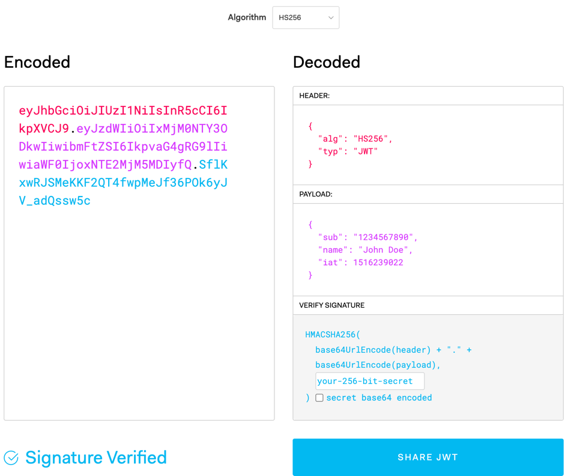
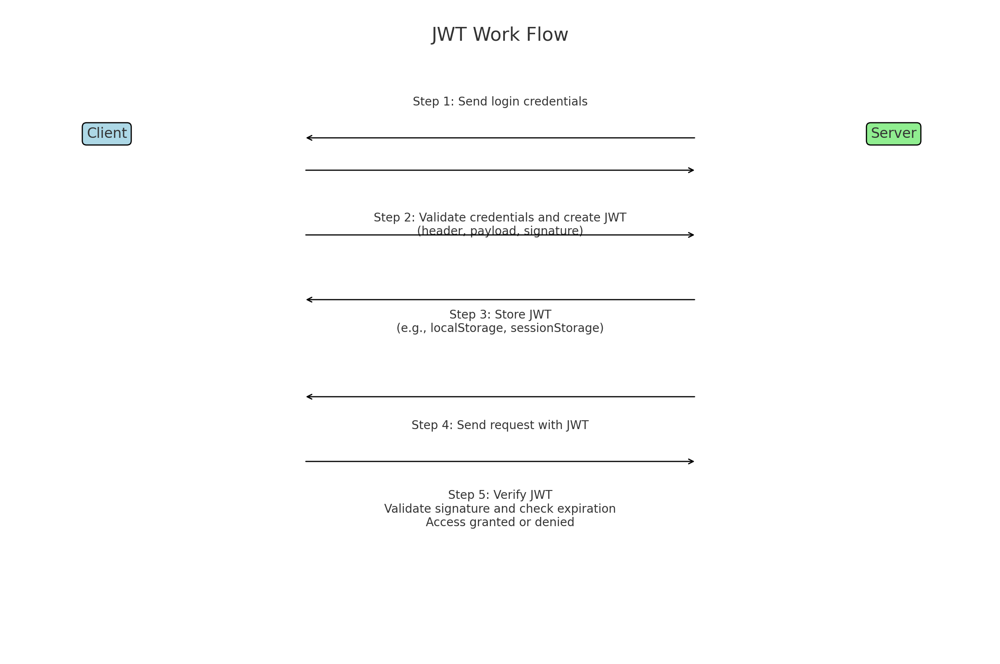

## Cookie
顾名思义，饼干，从维基百科了解到，这个词是网络浏览器程序员Louis J. Montulli II发明，来源于magic cookie（UNIX程序首发的数据包）。

说起来这个，就不得不谈到 fortune cookie。记得第一次到多伦多的中餐厅，忘记是什么店子，应该是川菜的店子，菜的味道就别提了，只要外国人多的中餐厅，那么味道就是怪的，不过印象最深的还是里面带有纸条的饼干，花里胡哨，哭笑不得

扯回正题，在这里cookie指的是由服务器发给浏览器的数据，并且这部分数据是可以保存在本地。一般存放在关于这个用户的相关数据，这样的话如果访问相同服务器的话，这个数据可以被利用起来，比如记录用户登陆的凭证，之后的访问不需要再登陆一次；喜好设置，比如页面背景设置等；比如浏览记录等等

### 基本结构
一个典型的 `Cookie` 包含以下字段：
- `Name`（名称）：`Cookie` 的名称
- `Value`（值）：`Cookie` 的值
- `Domain`（域名）：可以访问此 `Cookie` 的域
- `Path`（路径）：可以访问此 `Cookie` 的路径
- `Expires/Max-Age`（过期时间）：`Cookie` 的有效期
- `HttpOnly`：如果设置为 true，`JavaScript` 无法通过 `document.cookie` 访问此 `Cookie`
- `Secure`：如果设置为 `true`，`Cookie` 只能通过 `HTTPS` 发送。
- `SameSite`：防止跨站请求伪造（CSRF）攻击，可能的值有 `Strict`、`Lax` 和 `None`

### 生命周期
- 会话 Cookie：未设置 Expires 或 Max-Age 的 Cookie 在浏览器会话结束时失效
- 持久性 Cookie：设置了 Expires 或 Max-Age 的 Cookie 在指定时间后失效
### 用法
1. 会话管理：
   - 例如用户登录状态的维护。服务器在用户登录时创建一个会话，并将会话 ID 以 Cookie 的形式发送给浏览器。每次浏览器请求时都会携带这个会话 ID，服务器据此识别用户
2. 个性化设置：
   - 存储用户的偏好设置，例如主题颜色、语言选择等。用户再次访问网站时，这些信息可以用于个性化页面显示
3. 追踪和分析：
   - 网站可以使用 Cookie 追踪用户行为，用于分析用户访问模式，优化用户体验。第三方广告网络也可以使用 Cookie 跟踪用户跨网站的行为，用于广告投放

### 实践
#### 服务器端可以通过 HTTP 响应头 Set-Cookie 设置 Cookie
```javascript
res.cookie('name', 'value', {
  maxAge: 900000,
  httpOnly: true,
  secure: true,
  sameSite: 'Strict'
});
```

#### 在客户端，JavaScript 可以使用 document.cookie 读取 Cookie
```javascript
const cookies = document.cookie.split(';').reduce((cookies, cookie) => {
    const [name, value] = cookie.split('=').map(c => c.trim());
    cookies[name] = value;
    return cookies;
}, {});
console.log(cookies);
```
## Session
这个也可以通过字面含义理解，一场会议？一场对话？一个学期？，大概就是一段时间的意思

从不同的角度，它有不同的含义，但是大体的感觉，或者说意境都是一样的

在计算机的含义内，session可以理解为一个存储在服务器的对象，用来维持服务器和客户端之间的对话，这个也跟cookie有着类似的作用，不过cookie是存在于客户端

### 工作原理
1. 创建会话：
   - 当用户首次访问应用程序时，服务器会为该用户创建一个唯一的会话 ID。这个会话 ID 通常是一个加密的随机生成的字符串
2. 存储会话信息：
   - 服务器会在内存、数据库或其他存储机制中保存会话 ID 和相关联的会话数据。这些数据可以包括用户信息、购物车内容、临时数据等
3. 传递会话 ID：
   - 服务器通过 HTTP 响应将会话 ID 发送给客户端。通常，客户端会将会话 ID 存储在 Cookie 中，并在后续请求中自动携带这个 Cookie
4. 识别用户
   - 每次客户端发送请求时，会附带会话 ID。服务器接收到请求后，通过会话 ID 查找会话数据，从而识别用户并提供相应的服务
   
在特定的网站连接中，如果客户端通过 Cookie 或 URL 提供 SessionID，服务器就能根据该 SessionID 访问存储在服务器端的会话变量。Session 的生命周期仅在特定的连接中有效，当关闭浏览器后，Session 会自动失效，之前注册的会话变量也随之失效


- 数据保存在服务器端会比cookie更安全，特别是在需要保存私密数据的时候，比如用户的登陆状态，如果放在cookie，客户端的电脑被监控或者入侵，这个状态就会被拿去，如果放在服务器，那么就不用担心这个问题，因为session只会暴露ID给客户端
- 还可以用来缓存用户数据，比如选中的购物车数据，如果用cookie实现存储，那么在A电脑加购了3个商品，在B电脑会看不见，如果放在session存储，那么服务器会存储购物车的加购商品数
- 不过还是有点问题，如果都保存在服务器，那么对服务器的性能要求很高，因此cookie，session的选择是需要综合考虑
- 同时这样对服务器的拓展也是有很大的考验，比如现在都会使用集群来组服务器，如果用户A登陆系统，通过的是机器A，那么如果下次的请求被分到机器B，则session又要考虑是否复制到机器B的问题

### 实践
1. 安装依赖
```bash
npm install express express-session
```
2. 设置会话
```javascript
const express = require('express');
const session = require('express-session');

const app = express();

app.use(session({
  secret: 'your_secret_key', // 用于加密会话 ID 的字符串
  resave: false, // 如果会话未修改，是否重新保存
  saveUninitialized: true, // 是否自动保存未初始化的会话
  cookie: { secure: false } // 设置为 true 需要 HTTPS
}));

app.get('/', (req, res) => {
  if (!req.session.views) {
    req.session.views = 1;
  } else {
    req.session.views++;
  }
  res.send(`Views: ${req.session.views}`);
});

app.listen(3000, () => {
  console.log('Server is running on http://localhost:3000');
});

```
设置了一个会话，并在每次请求时增加视图计数（views）。会话数据存储在服务器端，通过会话 ID 进行关联

## JWT  [Json Web Token](https://jwt.io/)

说到JWT，就需要聊一下Token

### Token
上面描述了cookie， session，我们知道这些都是数据，一个是保存在客户端，一个是保存在服务器端，那么在用户登录校验领域，这两个方案都不是特别好

因此token可以被拿来使用，如果用户A要去登陆的时候，服务器下发一个token给用户A，用户A做其他操作的时候，携带上这个token，那么就代表了这个用户已经登陆了

这个token是不是像session的ID，是的，那么这个token如果被其他人偷去并伪造一个，那么这个登陆状态也会被偷去，这时候我们就用到了加密

这时候我把用户的token用加密算法，在使用一个特殊的密钥，对这个token加密，那么这个加密后的token可以被称作signature，用户下次请求带上signature，那么服务器端对这个signature解密，发现如果是一致，则认证成功，反之亦然

当然如果这个signature都被偷去，那就没办法了，在线上，会有多重认证，比如缩短token的期限，轮换密钥，使用强加密算法，监控异常日志等等

跟session的ID比起来，token
- 不需要太多存储空间
- 可拓展
- 无状态
- 跨程序，比如移动端和浏览器端
- 安全

### JWT详解
#### JWT是什么
- JSON Web Token （JWT） 是一个开放标准 （RFC 7519），它定义了一种紧凑的、自包含的方式，用于作为 JSON 对象在各方之间安全地传输信息。该信息可以被验证和信任，因为它是数字签名的。
- 简单来说就是 JWT （Json Web Token） 是实现 token 技术的一种解决方案
#### JWT结构
JWT 由三个部分组成，每个部分之间用点（.）分隔：

例如： `xxxxx.yyyyy.zzzzz`

- Header（头部）：包含令牌的类型（JWT）和签名算法（例如 HMAC SHA256 或 RSA）
  - `alg`：签名算法（如 HMAC SHA256）
  - `typ`：令牌类型，通常为 JWT
```json
{
  "alg": "HS256",
  "typ": "JWT"
}
```
用 Base64 对这个 JSON 编码就得到 JWT 的第一部分: `xxxxx`
- Payload（负载）：包含声明（claims），即传递的数据。声明可以包括预定义的标准声明（如 iss【issuer】发布者的 url 地址、exp【expiration】 该 jwt 销毁的时间；unix 时间戳、sub【subject】该 JWT 所面向的用户，用于处理特定应用，不是常用的字段 等），也可以包括自定义声明
  - `sub（Subject）`：令牌面向的用户
  - `name`：用户的名字
  - `iat（Issued At）`：令牌的签发时间（时间戳）
```json
{
   "sub": "1234567890",
   "name": "John Doe",
   "iat": 1516239022
}
```
对 payload 进行 Base64 编码就得到 JWT 的第二部分: `yyyyy`

- Signature（签名）：用于验证令牌的发送方和数据的完整性
签名是对 header 和 payload 进行编码并拼接起来，然后用指定的算法和密钥进行哈希生成的
```
HMACSHA256(base64UrlEncode(header) + "." + base64UrlEncode(payload),secret)
```
签名是用于验证消息在传递过程中有没有被更改，并且，对于使用私钥签名的 token，它还可以验证 JWT 的发送方是否为它所称的发送方



### JWT工作原理
- 客户端请求登录：用户在客户端登录并向服务器发送凭据（例如用户名和密码）。
- 服务器验证凭据：服务器验证用户凭据是否正确。如果验证通过，服务器生成一个 JWT。
- 服务器返回 JWT：服务器将生成的 JWT 返回给客户端。
- 客户端存储 JWT：客户端通常会将 JWT 存储在本地存储（如 `localStorage` 或 `sessionStorage`）。
- 客户端请求受保护资源：客户端每次请求受保护的资源时，都在请求头中包含 JWT（通常在 `Authorization` 头中，格式为 `Bearer <token>`）。
- 服务器验证 JWT：服务器验证 JWT 的签名和有效性。如果验证通过，服务器允许访问受保护资源



### JWT示例

```javascript
const jwt = require('jsonwebtoken');

// 秘钥
const secretKey = 'your-256-bit-secret';

// 生成 JWT
const token = jwt.sign({ userId: 123, role: 'admin' }, secretKey, { expiresIn: '1h' });
console.log('Generated JWT:', token);

// 验证 JWT
jwt.verify(token, secretKey, (err, decoded) => {
  if (err) {
    console.error('JWT verification failed:', err);
  } else {
    console.log('Decoded JWT payload:', decoded);
  }
});
```

参考资源：
[理解 cookie、session、token、jwt](https://learnku.com/articles/30051)