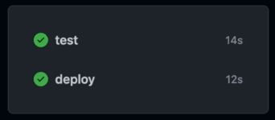
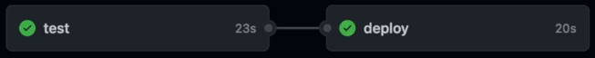
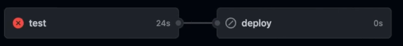
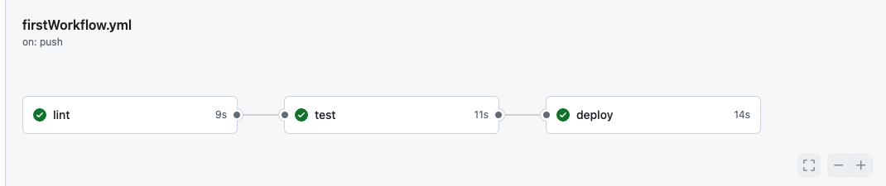
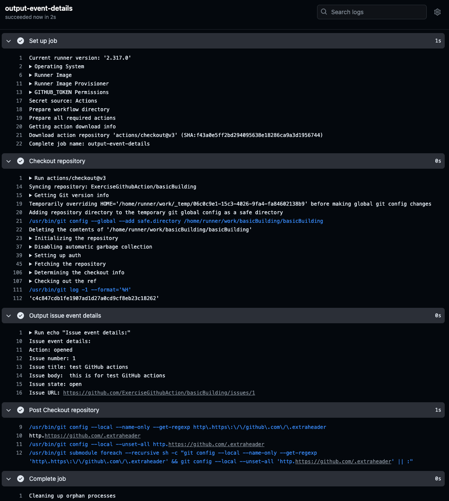

## 什么是[GitHub Actions](https://docs.github.com/en/actions)

GitHub Actions 是 GitHub 提供的一种持续集成和持续部署（CI/CD）服务。它允许开发者在 GitHub 仓库中自动化他们的工作流，例如构建、测试和部署代码。通过定义工作流文件，开发者可以在代码仓库的特定事件（如代码推送、Pull Request 等）发生时自动触发相应的任务

### [Workflows](https://docs.github.com/en/actions/using-workflows)
GitHub Workflows（工作流）是 GitHub Actions 的核心概念之一。

它们是描述在代码仓库中自动化任务的一系列定义。工作流通常用 YAML 格式编写，并存储在仓库的 `.github/workflows` 目录中。

每个工作流文件定义了在特定**Event**发生时应该执行的一系列**steps**和**jobs**

这里有一个简单的例子：

```yaml
name: First Workflow
on: workflow_dispatch
jobs:
  first-job:
    runs-on: ubuntu-latest
    steps:
      - name: Print greeting
        run: echo "Hello World!"
      - name: Print goodbye
        run: echo "Done - bye!"
```
这个工作流是只能手动触发，然后会在执行记录上看到两个语句的输出

下面这个例子是相对于上面的例子更加实际的例子
```yaml
name: CI

on:
  push:
    branches:
      - main

jobs:
  build:
    runs-on: ubuntu-latest

    steps:
    - name: Checkout code
      uses: actions/checkout@v4

    - name: Set up Node.js
      uses: actions/setup-node@v4
      with:
        node-version: '14'

    - name: Install dependencies
      run: npm install

    - name: Run tests
      run: npm test
```
这个工作流在每次推送到 `main` 分支时触发，主要包含以下几个步骤：

1. 检出代码。
2. 设置 Node.js 环境。
3. 安装项目依赖。
4. 运行测试。

### [Jobs](https://docs.github.com/en/actions/using-jobs)

工作流由一个或多个作业组成，每个作业可以并行或按顺序执行。每个作业运行在一个独立的虚拟环境中，这个环境之间是完全隔离的，并包含多个步骤

- 定义一个runner （执行环境，比如 linux，mac，windows）
- 包含一个或多个Steps
- 支持并行或者串行执行
- 可以根据条件执行

这里有个例子：
```yaml
jobs:
  build:
    runs-on: ubuntu-latest
    steps:
      - name: Checkout code
        uses: actions/checkout@v4
      - name: Set up Node.js
        uses: actions/setup-node@v4
      - name: Install dependencies
        run: npm install
      - name: Run tests
        run: npm test

```
#### 多个job运行机制
- 每个job都会有自己的runner
- 多个job可以并行执行，默认是并行，也可以串行执行

- 可以通过`needs`关键字来指定job的依赖关系，比如一个job依赖另一个job的输出

  - 如果上一个job失败，则下一个job不会运行
  
- 可以通过`if`关键字来指定job的条件，比如只有在某个条件下才执行
- 可以通过`continue-on-error`来指定job失败后是否继续执行
- 可以通过`timeout-minutes`来指定job的超时时间

### Steps
每个Job包含多个步骤，每个步骤可以执行一个单独的操作

- 这些操作可以是运行命令、调用 Shell 脚本或使用预定义的 GitHub Action
  - 使用shell脚本的时候，可以通过symbol `|` 来连接多个命令
- 可以用第三方库的action，也可以用github提供的action
- 按顺序执行
- 可以根据条件执行


例如，安装依赖和运行测试的步骤：

```yaml
steps:
  - name: Install dependencies
    run: npm install
  - name: Run tests
    run: npm test
```

如果需要执行多行Shell命令，可以使用管道符 `|` 连接多个命令：

```yaml
steps:
  - name: Run multiple commands
    run: |
 	    echo "First output"
	    echo "Second output"
```

### Events
[Events that trigger workflows](https://docs.github.com/en/actions/using-workflows/events-that-trigger-workflows)
工作流的触发条件，指定在什么情况下工作流应该运行
- push
  - 一旦push，就自动触发
  - 可以指定分支，比如main
- pull_request
  - 一旦有pull request，就自动触发
- release
  - 一旦有release，就自动触发
- schedule
  - 定时触发
- workflow_dispatch
  - 手动触发
- 如果这两个都加了，然后可以同时触发两次，比如push+手动
  - 可以通过`workflow_dispatch`来手动触发
  - 可以通过`on`来指定触发条件
      ```yaml
      name: Deploy Project
      on: [push, workflow_dispatch]
      ```
- ...


### [Actions](https://docs.github.com/en/actions/creating-actions)

Actions 是一个独立的任务，可以在工作流中执行。它们是可重用的，可以在多个仓库中使用

- 一个action可以包含多个步骤，可以把它看作执行复杂，频繁重复任务的应用程序
- 可以构建自己的 Actions，但也可以使用官方或社区 Actions

Command: `run` or `uses`

key `with` 是用来传递配置参数的

可以从这里找到更多的Actions [Marketplace](https://github.com/marketplace?type=actions)

#### 这里举个例子

使用 git 将代码从存储库克隆到runner上 这个可以作为一个action

如果要自己去写这个action，这是极其不必要的，这是非常常见的任务，GitHub团队已经创建了一个用于执行此操作的操作，可以在市场中找到

[Action-checkout](https://github.com/actions/checkout) 这个是官方提供的action，用于clone代码到runner

如果不使用官方的action，可以自己写一个action，然后发布到marketplace，供其他人使用，也就是造轮子

当然这里如果非要自己去写这个action，也是可以的，这里有一个例子

```yaml
name: Manual Checkout

on: [push]

jobs:
  build:
    runs-on: ubuntu-latest

    steps:
      - name: Set up Git
        run: |
          git config --global user.name "github-actions[bot]"
          git config --global user.email "github-actions[bot]@users.noreply.github.com"

      - name: Checkout code manually
        run: |
          git clone https://github.com/${{ github.repository }}.git
          cd ${{ github.event.repository.name }}
          git fetch
          git checkout ${{ github.sha }}
```
当然这个例子只是简单的示例，如果想实现，需要考虑仓库权限的问题等等，从这里就可以看出，使用官方的action是多么的方便

#### 运行机器环境与预装软件
通过上面一个例子，我们可以获取自己的代码，但是如果我们的代码需要运行在一个特定的环境中，比如nodejs，那么我们就需要设置这个环境

如果我们准备使用的是机器是ubuntu，那么我们可以使用`runs-on: ubuntu-latest`来设置运行环境，这个是一个必须的设置，ubuntu是默认安装了nodejs

从这里可以看到机器系统对应的预装软件： **[runner-images](https://github.com/actions/runner-images)**


如果我们还需要安装nodejs，那么我们可以使用`uses: actions/setup-node@v4`来设置nodejs环境， `with: node-version: '14'`来设置nodejs的版本

#### 失败
如果一个步骤失败，默认情况下整个工作流就会失败，这个时候可以通过`continue-on-error: true`来设置，这样即使一个步骤失败，也会继续执行下一个步骤

然后可以通过log来查看失败的原因，GitHub actions会给出很多的log，可以帮助我们找到问题

### Expression & Context Object
#### [Contexts](https://docs.github.com/en/actions/learn-github-actions/contexts)
在workflow里，可以获取GitHub的这个context 信息, `${{ <context> }}`

例子：
- 可以通过`${{ }}`来引用变量
- 可以通过`${{ github.event }}`来引用事件的信息
- 可以通过`${{ github.repository }}`来引用仓库的信息

#### [Expressions](https://docs.github.com/en/actions/learn-github-actions/expressions)
在workflow里，可以通过expressions来获取这个context信息，或者设置环境变量等 `${{ <expression> }}`

expression里面可以是值、上下文引用或函数的任意组合

例子：
```yaml
name: Output information
on: workflow_dispatch
jobs:
  info:
    runs-on: ubuntu-latest
    steps:
      - name: Output GitHub context
        run: echo "${{ toJSON(github) }}"
```

## Exercise

### Exercise1
lint, test, deploy on `push`
- run the `lint`, `test`, `build` scripts
- use one or three jobs running after each other

code:
```yaml
name: Lint, Test & Deploy Project
on: [push, workflow_dispatch]
jobs:
  lint:
    runs-on: ubuntu-latest
    steps:
      - name: Get code
        uses: actions/checkout@v3
      - name: Install NodeJS
        uses: actions/setup-node@v3
        with:
          node-version: 18
      - name: Install dependencies
        run: npm ci
      - name: Run Lint
        run: npm run lint
  test:
    needs: lint
    runs-on: ubuntu-latest
    steps:
      - name: Get code
        uses: actions/checkout@v3
      - name: Install NodeJS
        uses: actions/setup-node@v3
        with:
          node-version: 18
      - name: Install dependencies
        run: npm ci
      - name: Run tests
        run: npm run test
  deploy:
    needs: test
    runs-on: ubuntu-latest
    steps:
      - name: Get code
        uses: actions/checkout@v3
      - name: Install NodeJS
        uses: actions/setup-node@v3
        with:
          node-version: 18
      - name: Install dependencies
        run: npm ci
      - name: Build project
        run: npm run build
      - name: Deploy
        run: echo "Deploying ..."
```

result:



### Exercise2
output event details on `issues`
- output event details in the shell via `echo`
- use the `github` context object to output the event details
编写一个工作流文件，当 `issues` 事件触发时，工作流会运行并输出事件的详细信息

code:
```yaml
name: Issue Details Output

on:
  issues:
    types: [opened, edited]

jobs:
  output-event-details:
    runs-on: ubuntu-latest

    steps:
    - name: Checkout repository
      uses: actions/checkout@v2

    - name: Output issue event details
      run: |
        echo "Issue event details:"
        echo "Action: ${{ github.event.action }}"
        echo "Issue number: ${{ github.event.issue.number }}"
        echo "Issue title: ${{ github.event.issue.title }}"
        echo "Issue body: ${{ github.event.issue.body }}"
        echo "Issue state: ${{ github.event.issue.state }}"
        echo "Issue URL: ${{ github.event.issue.html_url }}"

```

result:


#### 解释
- 这个工作流文件定义了以下内容
    - 1.  **工作流名称**：`Issue Details Output`。
    - 2.  **触发事件**：`issues` 事件，当问题被打开或编辑时触发。
    - 3.  **作业名称**：`output-event-details`。
    - 4.  **运行环境**：`ubuntu-latest`。
    - 5.  **步骤**：
        - **检出代码库**：使用 `actions/checkout@v2` 操作检出代码库。
        - **输出问题事件详情**：通过 `echo` 命令在 shell 中输出 `issues` 事件的详细信息。
    - 解释关键部分：
        - `on: issues: types: [opened, edited]`：指定工作流在 `issues` 事件被触发时运行，尤其是在问题被打开或编辑时。
        - `${{ github.event.action }}`：访问 GitHub 上下文中的事件动作（例如 `opened` 或 `edited`）。
        - `${{ github.event.issue.number }}`：访问问题编号。
        - `${{ github.event.issue.title }}`：访问问题标题。
        - `${{ github.event.issue.body }}`：访问问题内容。
        - `${{ github.event.issue.state }}`：访问问题状态。
        - `${{ github.event.issue.html_url }}`：访问问题的 URL。
        - 这个工作流将帮助你在 shell 中输出 `issues` 事件的详细信息。每当一个新的问题被打开或现有的问题被编辑时，工作流将被触发并输出相应的事件详细信息。