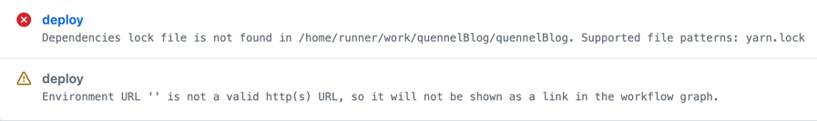

This article is mainly to record how to deploy static web pages on Github, study Github Action, and list the problems encountered

## What is Github Pages，Github Action？
Please check [Introduction to GitHub Packages](https://docs.github.com/en/packages/learn-github-packages/introduction-to-github-packages)
According to the official explanation, Github Pages can be used as a static web page hosting server. Through this server, we can quickly deploy our own static applications for free

About Github Action detailed explain，you can see [Publishing and installing a package with GitHub Actions](https://docs.github.com/en/packages/managing-github-packages-using-github-actions-workflows/publishing-and-installing-a-package-with-github-actions)

## How to setup Github Pages
[Official Stream](https://pages.github.com/)
- **Create your repository**
- **Change pages setting in repository**
- **Change setting in environment**
## How to setup Github Action
[Understanding GitHub Actions](https://docs.github.com/en/actions/learn-github-actions/understanding-github-actions)
- **Add yml in repository directory**
- **Refer to the following configuration of this blog[deploy-to-github-pages.yml](https://raw.githubusercontent.com/quennelorg/quennelBlog/main/.github/workflows/deploy-to-github-pages.yml)**
## QA
### yarn exit code 127

There are two solutions to this problem, and it should be the second one that works.
- Build locally, and then upload yarn.lock synchronously
- In the deployment yml file, clearly describe the file directory hierarchy. The structure of the project is that the deployment file is in the root directory, and then the project folder is also in the root directory.
- All reference paths to files in yml need to be added `./my-website`，The following questions all have similar issues
- Reference answer [Github actions: Dependencies lock file is not found in runners/path](https://stackoverflow.com/questions/68639588/github-actions-dependencies-lock-file-is-not-found-in-runners-path)
### actions/upload-pages-artifact fails

Change Function：
[Change Default work dir](https://stackoverflow.com/questions/58139175/running-actions-in-another-directory)

Reference answer：[actions/upload-pages-artifact fails at actions/upload-artifact with "No files were found with the provided path"](https://stackoverflow.com/questions/73310631/actions-upload-pages-artifact-fails-at-actions-upload-artifact-with-no-files-we)
## Future Plan
- This time we deployed docusaurus static web pages. I plan to study next.js, hexo, Jekyll, gatsby, etc. in the future.
- Dynamic website，react，vue，uniapp
