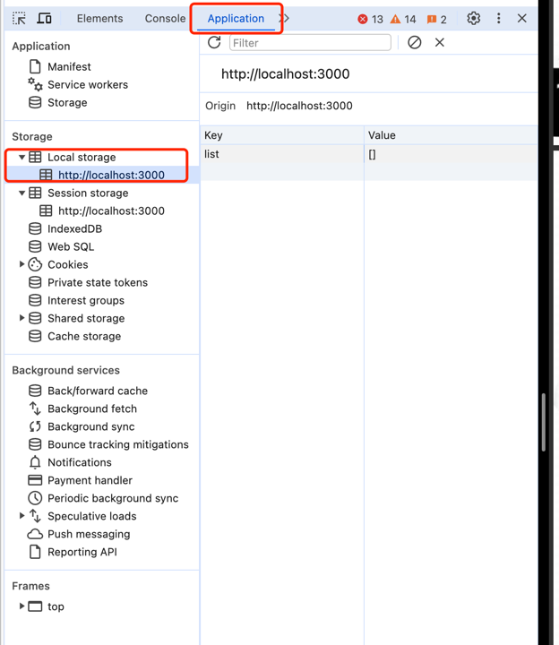

## Study the relationship between react hook and localStorage
When doing todo localStorage, I found that the relationship between useState, useEffect and localStorage is very vague.
Inexplicable bugs often occur, and we don’t know how they work, so here is a general survey of these three.

### [localStorage](https://developer.mozilla.org/en-US/docs/Web/API/Window/localStorage)

The localStorage read-only property of the window interface allows you to access the Storage object of the Document source;
Stored data is saved across browser sessions, which means you can close the browser and still have access to it when you visit again.

localStorage is similar to sessionStorage, except that localStorage data has no expiration time, while sessionStorage data will be cleared when the page session ends (that is, when the page is closed).
Local storage data for documents loaded in a Private Browsing or Incognito session will be cleared when the last Private tab is closed.
[The difference between sessionStorage, localStorage and cookie](https://juejin.cn/post/6844903713098694664)

### [useEffect](https://react.dev/reference/react/useEffect)
useEffect is a React Hook that allows you to synchronize components with external systems.
[Based on useEffect to encapsulate high-order hook API](https://juejin.cn/post/7078908086487875592)
[Using localStorage with React hooks](https://lightrains.com/blogs/using-localstorage-hook-react/)

### [useState](https://react.dev/reference/react/useState)
useState is a React Hook that lets you add state variables to your components.